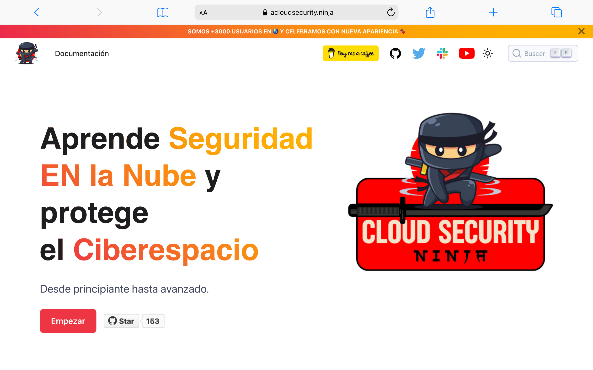

<p align="center">
<!-- ALL-CONTRIBUTORS-BADGE:START - Do not remove or modify this section -->
[](#contributors-)
<!-- ALL-CONTRIBUTORS-BADGE:END -->
  <a href="https://acloudsecurity.ninja">
    
  </a>
</p>

<h1 align="center">
  Bienvenido/a 👋
</h1>

<p align="center">
   Cloud Security Ninja es una plataforma de aprendizaje de Seguridad en nube que ha sido diseñada para ayudar a quienes deseen dar sus primeros pasos en el apasionante mundo de la Ciberseguridad y que esto les permita generar nuevas oportunidades profesionales en una área con muchísima demanda laboral.
</p>

<p align="center">
    Visite la <b><a href="https://acloudsecurity.ninja/docs/">📚 Documentación</a></b> para inciar tu carrera como Cloud Security Engineer.
    [](https://github.com/firstcontributions/open-source-badges)
    [](https://youtube.com/@awssecuritylatam?sub_confirmation=1)
    [](https://twitter.com/gerardokaztro)
    
</p>

[](https://github.com/firstcontributions/open-source-badges)
[](https://youtube.com/@awssecuritylatam?sub_confirmation=1)
[](https://twitter.com/gerardokaztro)

<!-- 
 -->

<h2 align="center">
  Cómo iniciar este lindo viaje 🚀
</h2>

### 👨‍💻 Sigue estas instrucciones si eres usuario
Lo primero, es hacer un `git clone` a este [repositorio](https://github.com/gerardokaztro/cloudsec-ninja) en una carpeta de tu local. Esto es para que puedas tener todo el código de los ejercicios que se realizarán en cada tema.

```bash
git clone https://github.com/gerardokaztro/cloudsec-ninja.git
```

> Si te gusta el contenido que ves aquí, no dudes en regalarle una 🌟 al repo

Todo el contenido de las diferentes secciones de aprendizaje de la plataforma se encuentran dentro de la carpeta `docs`. Algunas secciones tendran código que podras usar para realizar los laboratorios, podrás encontralo dentro de la carpeta `code`. Por ejemplo: `docs/fundamentos/code` o `docs/cloud/code`.

```
.docs
├── fundamentos-de-ciberseguridad
│   ├── code/
│   ├── img/
│   └── .
├── fundamentos-de-nube
│   ├── code/
│   ├── img/
│   └── .
└── fundamentos-de-tecnologia
    ├── code/
    ├── img/
    └── .
```

### 👷‍♀️ Sigue estas instrucciones si eres contribuidor
Esta plataforma esta basada en [Docusaurus](https://docusaurus.io) un generador de sitios estáticos hecho en React, una de las principales bibliotecas de JavaScript, como biblioteca de interfaz de usuario para la creación de páginas.

Y se ha utilizado [Vercel](https://vercel.com/) como hosting debido a su capacidad de desplegar, gestionar y escalar aplicaciones y sitios web. Además que Vercel proporciona una amplia gama de funciones, como despliegues automatizados, entre otras funciones interesantes.

Con esto, la fase `build` se encuentra automatizada al momento de merguear los cambios a la rama `main`,

> Asegúrate de echarle un vistazo a nuestra [guía para contribuidores](https://github.com/gerardokaztro/cloudsec-ninja/blob/main/CONTRIBUTING.md) antes de empezar como contributor.

#### 🎮 Pre requisitos

- Tener instalado Git
- Tener instalado Node.js v18.x.x o superior
- Forkear este [repositorio](https://github.com/gerardokaztro/cloudsec-ninja)
- Despues de tener el repositorio en nuestra cuenta personal de Github, clonarlo
```bash
git clone https://github.com/<tu-nombre-de-usuario>/cloudsec-ninja.git
```
- Dentro de la carpeta local que genera, comprobar la URL del repositorio:
```bash
git remote -v
```
- Antes de realizar modificaciones agregar la URL del repositorio **original** del proyecto:
```bash
git remote add upstream https://github.com/gerardokaztro/cloudsec-ninja
```
- Comprobar:
```bash
git remote -v
```
- Antes de empezar a trabajar, obtener los últimos cambios del repo Original:
```bash
git pull -r upstream main
```
- Crear rama `developement` en tu local
```bash
git checkout -b development
```
- Obtén un preview de la plataforma en tu localhost
```bash
npm start
```
> Esto permite obtener una previsualización de tus cambios en tu `localhost`
<p align="center">
    
</p>

- Cambia a la carpeta `docs` y [añade tu contenido](#cómo-añadir-mi-contenido)
```bash
cd docs/
```
- Envía tus cambios al repositorio
```bash
git push origin development
```

Finalmente, crea un **Pull Request** desde tu rama `development` a `main` del repositorio original.

> Esto será revisado por los *code owners* y presta atención por si dejan algún comentario que debas revisar y responder, para que decidan aprobar tu cambio. 

##### Cómo añadir mi contenido

Todo contenido que deseen añadir como contribuidores, debe estar alineado a cualquiera de las secciones o dominios que se presentan en [Ruta de Aprendizaje](https://acloudsecurity.ninja/docs/ruta-de-aprendizaje).

Sin embargo, si quieres proponer un nuevo tema asegúrate de contactar con el autor para que pueda revisar tu nueva propuesta y realice una actualización en el roadmap.

1. Si vas añadir contenido dentro de un archivo existente, entonces ubica el archivo y empeza a escribir.

    1.1 Por ejemplo, quieres añadir un video sobre AWS Control Tower, o quizas hacer una correción sobre una característica mal explicada, entonces la ruta seria [`docs/gobierno/aws-control-tower.md`](https://github.com/gerardokaztro/cloudsec-ninja/blob/development/docs/gobierno/aws-control-tower.md)

2. Si vas a añadir contenido sobre una página aun no creada y ya validaste que forma parte del roadmap, entonces puedes crearla tu mismo, asi:

    2.1 Por ejemplo si quieres escribir sobre AWS Organization, la ruta seria [`docs/gobierno/`](https://github.com/gerardokaztro/cloudsec-ninja/blob/development/docs/gobierno/)

    2.2 Luego, crear el nuevo fichero, y colocar un nombre con el formato `titulo-del-post.md` o `titulo-del-post.md`. No incluyas ni tildes, ni espacios, ni mayúsculas, ni underscope (_). Un ejemplo de título válido es `aws-organizations.md` o `awsorganizations.md` o `organizations.md`.

3. Un artículo está compuesto de dos secciones, metadatos y contenido, separadas por dos líneas vacías. Los metadatos **son obligatorios** y sirven para clasificar el artículo y son los siguientes:

    | Clave   | Descripción                                  |
    |---------|----------------------------------------------|
    | sidebar_label: | Nombre del artículo de como se verá reflejado en el sidebar de la página |
    | tags: | Array que contiene las etiquetas para clasificar el contenido |

> 💡 Usa este artículo como referencia, contiene la [estructura de un artículo](https://raw.githubusercontent.com/gerardokaztro/cloudsec-ninja/development/docs/fundamentos-de-tecnologia/redes.md) que debes seguir al momento de escribir tu contenido.

<h2 align="center">
  Descargo de responsabilidad 🚨
</h2>

> **NO** ejecute ninguno de los laboratorios junto con sus entornos e infraestructura de producción. Recomendamos ejecutar esto en un entorno seguro y aislado.

> Esta plataforma **NO** ofrece cuentas sandbox ni se hace responsable por los gastos que pueden llegar a generar los laboratorios que se compartan aquí.

> Recuerda que esta plataforma es gratuita y usted asume toda la responsabilidad de los recursos que utilice para el desarrollo de los ejercicios.
<!-- 
<h2 align="center">
  Reglas de la casa ✋
</h2>

[Código de conducta](https://github.com/gerardokaztro/cloudsec-ninja/blob/main/CODE_OF_CONDUCT.md)

<h2 align="center">
  Licencia 📜
</h2>

[GNU General Public License v3.0](https://github.com/gerardokaztro/cloudsec-ninja/blob/main/LICENSE) -->

## Contributors ✨

Thanks goes to these wonderful people ([emoji key](https://allcontributors.org/docs/en/emoji-key)):

<!-- ALL-CONTRIBUTORS-LIST:START - Do not remove or modify this section -->
<!-- prettier-ignore-start -->
<!-- markdownlint-disable -->
<table>
  <tbody>
    <tr>
      <td align="center" valign="top" width="14.28%"><a href="https://github.com/elissamburu"><br /><sub><b>Rodrigo Elissamburu</b></sub></a><br /><a href="#content-elissamburu" title="Content">🖋</a></td>
    </tr>
  </tbody>
</table>

<!-- markdownlint-restore -->
<!-- prettier-ignore-end -->

<!-- ALL-CONTRIBUTORS-LIST:END -->

This project follows the [all-contributors](https://github.com/all-contributors/all-contributors) specification. Contributions of any kind welcome!