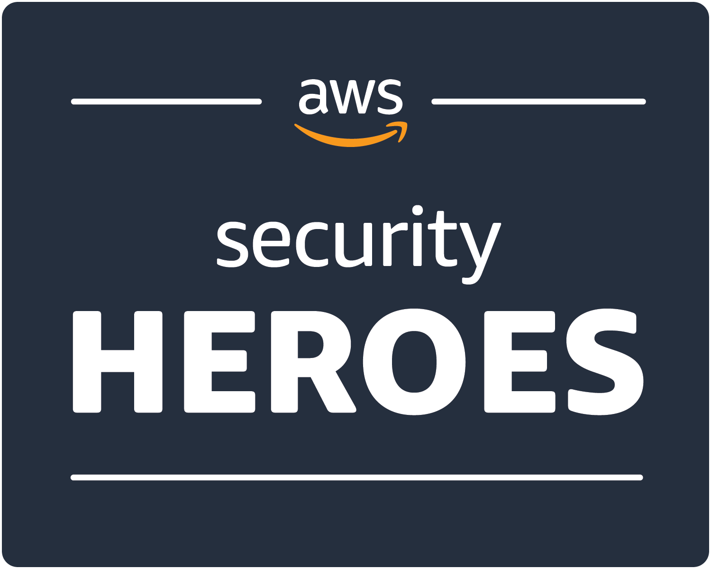

# 💪 ¿Qué me motiva?
**[Gerardo Castro](https://www.linkedin.com/in/gerardokaztro/)** en adelante *"Gera"*, es quién diseñó **Cloud Security Ninja**. El sabe que en el mundo de tecnología existen muchas brechas, algunas de ellas es no tener dominio del Inglés (un idioma muy necesario para quienes trabajamos en tecnología), otra que el contenido en español aun puede seguir en aumento y otra finalmente, puede ser que existan personas cuyo ingreso económico no es lo suficientemente bueno para costear un curso o bootcamp de seguridad que tranquilamente puede valer los 500~1000 dólares a manos de los grandes referentes y expertos que existen en el área.

Ante todas esas desventajas, es que nace **Cloud Security Ninja** cuyo único proposito, es sencilla y llanamente el de compartir conocimiento de los que más saben, con quienes no, de esta manera podemos ayudar a que mas personas puedan desarrollar habilidades técnicas y como consecuencia expandir el espectro de las oportunidades profesionales y laborales que pudiesen conseguir.

## Sobre el autor
**[Gerardo](https://www.linkedin.com/in/gerardokaztro/)** es consultor de Ciberseguridad en nube. Le gusta escribir blog técnicos y hablar sobre ciberseguridad en eventos presenciales y virtuales para diferentes comunidades tech en Latinoamérica. Además, crea y dirige videos, podcasts, clases en línea y talleres enfocados en AWS. Con sus consejos, [ha inspirado a muchas personas a iniciar y hacer crecer su carrera en la nube](https://www.youtube.com/watch?v=woLZeatJGHg).

El cree que un gran poder conlleva una gran responsabilidad y, por lo tanto, su misión durante los últimos años ha sido compartir su conocimiento y experiencia en seguridad con los **[usuarios de las comunidades de AWS en la región](https://aws.amazon.com/es/developer/community/usergroups/?nc1=h_ls&community-user-groups-cards.sort-by=item.additionalFields.ugName&community-user-groups-cards.sort-order=asc&awsf.location=location%23latam&awsf.category=*all)**. Algunos de los ejemplos más destacados es el **[Cybersecurity Bootcamp](https://github.com/gerardokaztro/cybersecurity-entry-level)** y los **AWS Security Days - Community Edition,** que son eventos impulsados por la comunidad organizados en algunos países como Argentina, Perú y Chile, y más por venir para otros países de habla hispana.

Gera fue **AWS Community Builder for Security & Identity** desde 2020 al 2023, y es organizador del **[AWS Security Users Group](https://www.meetup.com/es/awssecuritylatam/)** en América Latina desde 2020.

En el 2023 obtuvo 2 nominaciones por parte de **AWS** como **AWS Security Black Belt** y la mas reciente y destacada **[AWS Security Hero](https://aws.amazon.com/es/developer/community/heroes/gerardo-castro/)** considerada un hito al ser nominado dentro del primer cohort a nivel mundial y ser el primero en Hispanoamérica.

Conoce a los demás **[AWS Heroes de Hispanoamérica](https://aws.amazon.com/developer/community/heroes/?nc1=h_ls&community-heroes-all.sort-by=item.additionalFields.sortPosition&community-heroes-all.sort-order=asc&awsf.filter-hero-category=*all&awsf.filter-location=location%23latam&awsf.filter-year=*all&awsf.filter-activity=*all).**