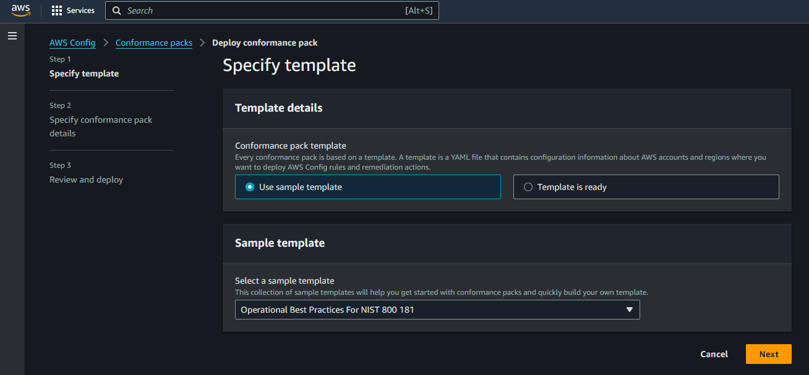
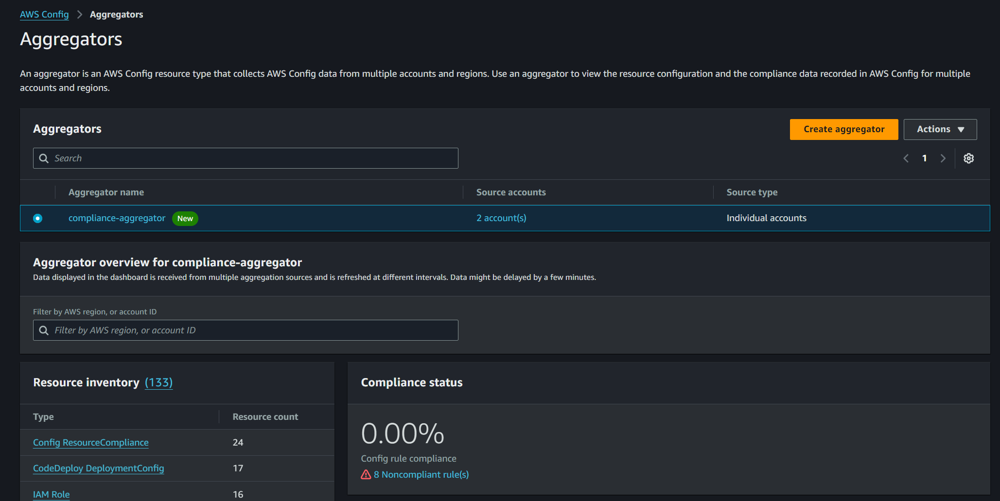

import ReactPlayer from 'react-player'

# AWS Config

## Introducción
AWS Config es un servicio que permite evaluar, auditar y monitorear las configuraciones de los recursos de AWS.Proporciona un registro detallado de los cambios de configuración, lo que ayuda a evaluar el cumplimiento de configuraciones específicas y permite auditar el historial de los recursos a lo largo del tiempo.

<p align="center">

</p>

## Funciones clave de AWS Config

- **Registro de Cambios de Configuración:** Rastrea los cambios en la configuración de los recursos de AWS, como los cambios en buckets S3, politicas IAM o configuraciones de instancias EC2.

- **Evaluación de Cumplimiento:** Permite definir reglas personalizadas o usar reglas predefinidas para verificar si los recursos están configurados de acuerdo con las políticas establecidas. Esto es útil para cumplir con estándares de seguridad y regulaciones.

- **Auditoría y Análisis:** AWS Config almacena instantáneas de la configuración de los recursos, lo que te permite revisar el estado histórico y realizar auditorías. También facilita la identificación de cuándo y cómo cambiaron los recursos.

- **Automatización de Respuesta:** Cuando se detectan configuraciones que no cumplen con las políticas establecidas se pueden automatizar acciones, como la generación de alertas o la corrección automática.

## Caracteristicas

- La información recopilada por AWS Config se puede almacenar en un bucket de S3 para facilitar su análisis posterior.
- Se integra con AWS CloudTrail para ofrecer un registro histórico de los cambios realizados en los recursos.
- AWS Config tambien puede integrarse con otros servicios como Amazon SNS, Lambda, CloudWatch y Systems Manager para enviar notificaciones o ejecutar acciones de remediación.

<p align="center">

</p>

## ¿Como activar AWS Config?

Para activar AWS Config, dirígete a la Consola de Administración de AWS y busca el servicio AWS Config


- Una vez encontrado el servicio, seleccionamos **Get started**
- En la sección **Recording method** especificaremos los recursos que registrará AWS Config. Podemos elegir registrar todos los recursos con la opción **All resource types with customizable overrides**, sin embargo para fines de esta guía seleccionaremos la opción **Specific resource types**.
- Una vez seleccionado la opción anterior, en la lista **Resource type** buscaremos "AWS EC2 Instance" y "AWS S3 Bucket"
- En la opción **Frecuency** seleccionaremos la opción "Continuos", con esto le indicaremos a AWS Config que registre la información de los recursos cada vez que ocurra un cambio en su configuración


- En la sección **Data Governance**, seleccionaremos la opción **Use an existing AWS Config service-linked role**,  si ya hemos activado AWS config en otras regiones este Rol ya existira, pero si es la primera vez el rol se generará automaticamente cuando habilitemos el servicio


- En la sección **Delivery method**, debemos indicarle al servicio AWS Config donde guardará todos los registros que recopile sobre nuestros recuros, para ello podemos crear un bucket o seleccionar uno existente 


- Seleccionamos **Next** y en la sección **Rules** por ahora no seleccionaremos ninguna regla
- Finalmente en la sección **Review** seleccionamos **Confirm** y esperamos unos segundos hasta que el servicio se active

Al finalizar el proceso, tendremos el servicio de AWS Config activado y podremos visualizar el dashboard principal


:::warning

Habilitar AWS Config genera costos, por lo que es recomendable limitar el monitoreo únicamente a tipos de recursos específicos. Para más detalles sobre los precios, puedes consultar el siguiente enlace: https://aws.amazon.com/config/pricing/

:::

## AWS Config Rules

Las AWS Config Rules son reglas que ayudan a verificar automáticamente si los recursos en AWS cumplen con ciertas políticas o estándares. Básicamente, estas reglas revisan de manera continua la configuración de tus recursos (como instancias EC2, buckets de S3, etc.) para asegurarse de que sigan las mejores prácticas o requisitos de seguridad.

### ¿Como configurar Config Rules?

Para activar una Config Rule, dirígete a la Consola de Administración de AWS y busca el servicio AWS Config


- Una vez encontrado el servicio, seleccionamos la opción **Rules** , en el panel izquierdo


- Seleccionamos **Add Rule** y se desplegará una lista de reglas administradas por AWS o **AWS managed rules**. También es posible crear reglas personalizadas utilizando AWS Lambda o Guard. Sin embargo, este tema se tratará en la última parte de esta guía.
- En el cuadro de búsqueda ingresaremos **s3-bucket** y seleccionaremos la regla **s3-bucket-level-public-access-prohibited**


- En la sección **Evaluation mode** podemos elegir en que momento se ejecutará la evaluación de la regla
  - **All changes** : Cuando cualquier recurso monitoreado por AWS Config, sufra un cambio en su configuración
  - **Rsources** : Cuando un tipo de recurso especifico monitoreado por AWS Config, sufra un cambio en su configuración
  - **Tags** : Cuando un recurso monitoreado por AWS Config, con un tag especifico sufra un cambio en su configuración

- Para nuestro ejemplo seleccionaremos **Resources** y en **Resouce type** buscaremos **AWS S3 Bucket**


- Las demás opciones las dejaremos por defecto
- Seleccionamos **Next** y **Save**


Ahora probaremos que nuestra regla funciona correctamente

- Buscamos el servicio **S3** y creamos un bucket
- En la sección **Block Public Access settings for this bucket** deshabilitaremos todos los checks y marcamos la casilla para aceptar que estamos configurando un bucket público


Ahora debemos esperar unos minutos, y si volvemos al servicio AWS Config, en la sección **Rules**, veremos que ahora existe un recurso incumpliendo la regla **s3-bucket-level-public-access-prohibited**


## Otras caractaeristicas útiles de AWS Config

### Resource timeline

El Resource Timeline en AWS Config es una vista cronológica que muestra los eventos y cambios de configuración asociados a un recurso específico en AWS. Permite ver cómo ha evolucionado la configuración de un recurso a lo largo del tiempo, lo que es útil para auditorías, cumplimiento normativo y resolución de problemas.

Estas son las principales caracteristicas:
- **Historial de configuración:** Muestra una lista cronológica de todos los cambios de configuración que AWS Config ha registrado para un recurso. Estos cambios pueden incluir modificaciones en propiedades del recurso, cambios en su estado o cualquier otra variación relevante.
- **Detalles de cada cambio:** Al hacer clic en un evento o cambio específico, puedes ver detalles más profundos sobre la configuración anterior y la nueva, lo que te permite hacer comparaciones y entender qué ha cambiado en el recurso.
- **Relación con reglas de compliance:** Si se tiene reglas de AWS Config activas, el Resource Timeline puede mostrar si un recurso fue considerado compliant o no compliant en algún momento en particular.

Para utilizar esta caracteristica, podemos seleccionar la opción **Resources** del menú lateral


- En los filtros de búsqueda, dentro del campo **Resource type**, seleccionaremos **AWS S3 bucket**
- Ahora podemos ver todos los buckets que tenemos creados


- Seleccionamos por ejemplo el bucket creado en la sección anterior **my-bucket-test-public**
- Ahora seleccionamos la opción **Resource Timeline**
- Esto nos mostrará todo el detalle de los cambios que ha sufrido este bucket


Por ejemplo podemos ver el detalle de los cambios a nivel de configuración que se realizaron sobre el bucket para que pueda de **Noncompliant** a **Compliant**. En este caso se marcaron las casillas para que el bucket tenga el bloqueo de acceso público habilitado.


:::warning

Para visualizar dentro del Resource Timeline los eventos de cumplimiento, es necesario ingresar a la opción **Settings** e incluir dentro del **Recording method** el Resource type **AWS Config ResourceCompliance**

:::

### Conformance packs

Los Conformance Packs son conjuntos que agrupan varias reglas de AWS Config en un solo paquete, lo que facilita su implementación y gestión de forma más eficiente.

Algunas de las caracteristicas principales de los conformance pack son:

- **Paquetes de reglas predefinidos:** AWS ofrece Conformance Packs predefinidos que cumplen con diversos estándares y marcos de seguridad, como **CIS AWS Foundations Benchmark**, **NIST 800-53**, **PCI DSS**, entre otros. Estas colecciones incluyen reglas de AWS Config específicas para cada estándar, lo que simplifica su adopción y monitoreo.
- **Personalización:** Se pueden crear Conformance Packs personalizados adaptados a los requisitos específicos de cada organización, combinando reglas personalizadas de AWS Config y acciones de remediación. Esto permite ajustar los paquetes para cumplir con políticas internas, estándares específicos o regulaciones regionales.
- **Reportes de cumplimiento centralizados:** Los Conformance Packs proporcionan una vista unificada del estado de cumplimiento para todas las reglas incluidas en el paquete. Esto simplifica el monitoreo y permite a las organizaciones generar reportes consolidados que muestren si su entorno está cumpliendo con un marco específico de seguridad o gobernanza.

Para utilizar esta caracteristica, podemos seleccionar la opción **Conformance packs** del menú lateral


- Seleccionamos el botón **Deploy conformace packs**, y configuraremos los pasos necesarios
- En la sección **Specify template**, podemos seleccionar una plantilla de la colección que nos brinda AWS o cargar una personalizada
- Para este ejemplo, seleccionaremos la plantilla **Operational Best Practices For NIST 800 181**



- Ahora especificamos un nombre para el conformance pack


- Finalmente seleccionamos **next** y **Deploy conformance pack**. Debemos esperar unos minutos a que se desplieguen todas las reglas asociadas al conformance pack


- Si seleccionamos el conformance pack **Operational Best Practices For NIST 800 181**, podemos observar el detalle de todas las reglas desplegadas y su cumplimiento


:::warning

No olvidar que cada regla desplegada por un conformance pack tiene un costo asociado.Para más detalles sobre los precios, puedes consultar el siguiente enlace: https://aws.amazon.com/config/pricing/

:::

### Aggregators

Los Aggregators en AWS Config son una funcionalidad que permite agrupar y visualizar datos de cumplimiento y configuración de recursos a nivel de múltiples cuentas y regiones de AWS.

**Para configurar un aggregator, primero debemos habilitar AWS Config en las cuentas que querramos visualizar**

Para este ejemplo, usaremos la **management account** de nuestra organización, pero tambien es posible configurar un administrador delegado para AWS Config


Primero seleccionamos la opción **Aggregators** del panel izquierdo y luego la opción **Create aggregator**


- Ingresamos un nombre en el campo **Aggregator name**
- En la sección **Select source accounts** seleccionaremos las cuentas sobre las cuales deseamos obtener información
- Finalmente en la sección **Regions** seleccionamos las regiones de las cuales queremos visualizar información


- Debemos esperar unos minutos para que la información pueda sincronizarse y poder visualizarse en nuestro agregador
- Luego de esto podremos visualizar la información




### Custom Rules

#### Creación de la función Lambda

Una custom rule en AWS Config es una regla personalizada que permite definir criterios específicos y adaptar la evaluación de acuerdo a las necesidades de una origanización o negocio. Es especialmente útil cuando necesitamos monitorear el cumplimiento de alguna normativa o regulación aplicable solo a determinados sectores.

Para poder configurar una **Custom Rule**, primero crearemos UNA función lambda que realizará la evaluación

- Ingresamos al servicio **AWS Lambda** y seleccionamos la opción **Functions**
- Ingresamos a la opción **Create function** e ingresamos los siguientes datos
  - **Function name:** iam-user-with-access-key-function
  - **Runtime:** Python 3.12
  - **Permissions:** Dejamos el rol por defecto que nos creará, el cual solo tiene permisos para Cloudwatch logs (más adelante lo modificaremos)


- Una vez creada la función lambda, ingresamos a la sección **Code** y copiamos el siguiente codigo, el cual permite evaluar si los usuarios IAM tienen creados access key. *Es una práctica de seguridad recomendada no asignar access key a usuarios debido a que no permite segregar correctamente sus permisos*.

```py title="iam-user-with-access-key-function"
import boto3

iam_client = boto3.client('iam')
config_client = boto3.client('config')
sns_client = boto3.client('sns')

sns_topic_arn = 'YOUR_ARN_SNS_TOPIC'

def publish_to_sns(subject, message):
    try:
        response = sns_client.publish(
            TopicArn=sns_topic_arn,
            Subject=subject,
            Message=message
        )
        return f"Mensaje publicado en SNS con ID: {response['MessageId']}"
    except Exception as e:
        return f"Error al publicar en SNS: {str(e)}"

def lambda_handler(event, context):
    # Obtener la lista de todos los usuarios IAM
    response = iam_client.list_users()
    users = response['Users']
    
    evaluations = []
    non_compliant_users = []
    
    for user in users:
        user_name = user['UserName']
        
        # Verificar si el usuario tiene Access Keys activas
        access_keys = iam_client.list_access_keys(UserName=user_name)['AccessKeyMetadata']
        
        # Definir el estado de cumplimiento
        compliance_type = 'COMPLIANT' if not access_keys else 'NON_COMPLIANT'
        annotation = f'El usuario {user_name} {"no tiene" if compliance_type == "COMPLIANT" else "tiene"} Access Keys activas.'

        # Agregar evaluación para cada usuario
        evaluations.append({
            'ComplianceResourceType': 'AWS::IAM::User',
            'ComplianceResourceId': user_name,
            'ComplianceType': compliance_type,
            'Annotation': annotation,
            'OrderingTimestamp': user['CreateDate']
        })
        
        # Si es NON_COMPLIANT, agregarlo a la lista para enviarlo al SNS
        if compliance_type == 'NON_COMPLIANT':
            non_compliant_users.append(user_name)

    # Publicar mensaje en SNS solo si hay usuarios no conformes
    if non_compliant_users:
        subject = "Lista de usuarios IAM con access keys"
        message = "Los siguientes usuarios IAM tienen access keys creadas:\n\n"
        message += "\n".join(non_compliant_users)
        sns_result = publish_to_sns(subject, message)
        print(sns_result)    
    
    # Enviar las evaluaciones a AWS Config
    result = config_client.put_evaluations(
        Evaluations=evaluations,
        ResultToken=event['resultToken']
    )
    
    return result        
```

- Seleccionamos la opción **Deploy** para guardar nuestros cambios y desplegarlos.
- Ahora nos dirigimos a la sección **Configuration** y seleccionamos el Rol que se creo por defecto.


- Seleccionamos **Create inline policy** para crear una politica en el rol 


- Seleccionamos la opción **JSON** y pegamos la siguiente politica:

```json
{
    "Version": "2012-10-17",
    "Statement": [
        {
            "Effect": "Allow",
            "Action": [
                "iam:ListUsers",
                "iam:ListAccessKeys",
                "config:PutEvaluations",
                "SNS:Publish"
            ],
            "Resource": "*"
        }
    ]
}
```


- En la sección **Policy name**, ingresamos el siguiente nombre **iam-user-with-access-key-function-policy** y seleccionamos **Create policy**


Finalmente, para que el servicio de AWS Config pueda invocar nuestra función lambda, es necesario configurar una **Resource-based policy**
- Para ello ejecutaremos el siguiente comando mediante cloudshell o AWS CLI:

```shell
aws lambda add-permission --function-name iam-user-with-access-key-function --action lambda:InvokeFunction --statement-id config --principal config.amazonaws.com
```


#### Configuración de la Regla en AWS Config

Para configurar la regla personalizada, buscamos el servicio de AWS Config y seleccionamos la opción **Rules** del panel izquierdo
- Seleccionamos la opción **Add Rule**


- Seleccionamos la opción **Create custom Lambda rule** y llenamos los campos necesarios
  - **Name:** iam-user-with-access-keys
  - **AWS Lambda function ARN:** YOUR_ARN_LAMBDA
  - **Evaluation mode** Periodic
  - **Frecuency** 24 hours


Debido a que hemos configurado la regla para que se ejecute cada 24 horas, no veremos resultados de inmediato. Si no queremos esperar podemos dirigirnos a la regla crada y seleccionar la opción **re-evaluate**


Finalmente, podemos observar que hemos podido identificar 2 recursos **NON_COMPLIANT**


## Autoremediaciones en AWS Config

Las remediaciones en AWS Config son acciones automatizadas que se ejecutan para corregir configuraciones que no cumplen con las reglas de cumplimiento definidas. Es decir, cuando un recurso es marcado como **NON_COMPLIANT** en una evaluación de AWS Config, se puede configurar una acción de remediación para corregir automáticamente el problema sin intervención manual.

Dichas remediaciones son ejecutadas a través del servicio AWS Systems Manager (SSM)

### 1. Creación de un Rol para remediaciones

Antes de iniciar con la configuración de la regla y la autoremediación, debemos crear un Rol wn AWS IAM, esto nos servirá para que los documentos de remediación puedan interactuar y modificar los recursos que tengan incumplimientos.

- Buscamos y seleccionamos el servicio **AWS IAM** y nos dirigimos a la sección **Roles**
- Seleccionamos la opción **Custom trust policy** y pegamos la siguiente politica. La cual permite que el servicio de Systems Manager (SSM) pueda asumir el Rol

```json
{
    "Version": "2012-10-17",
    "Statement": [
        {
            "Sid": "",
            "Effect": "Allow",
            "Principal": {
                "Service": "ssm.amazonaws.com"
            },
            "Action": "sts:AssumeRole"
        }
    ]
}
```

- Damos clic en **Next** (sin agregar permisos todavia)
- Finalmente ingresamos el nombre **RemediationAWSConfigRol** y seleccionamos **Create Rol**


- Ahora seleccionamos el Rol creado y agregamos la siguiente **inline policy**

```json
{
    "Version": "2012-10-17",
    "Statement": [
        {
            "Sid": "ChangeAutomation1",
            "Effect": "Allow",
            "Action": [
                "ssm:StartChangeRequestExecution",
                "ec2:ModifyInstanceMetadataOptions",
                "ec2:DescribeSecurityGroups",
                "ec2:RevokeSecurityGroupIngress",
                "ec2:RevokeSecurityGroupEgress",
                "ec2:DescribeInstances",
                "sns:Publish"
            ],
            "Resource": "*"
        }
    ]
}
```

- Ingresamos el nombre **RemediationAWSConfigPolicy**y seleccionamos **Create policy**


### 2. Creación de una regla
Para este ejemplo , crearemos la regla **ec2-imdsv2-check** en AWS Config, la cual verifica si las instancias EC2 están configuradas para usar la versión 2 del servicio de metadatos de instancias (IMDSv2)


:::info

### ¿Qué es IMDSv2?
El Instance Metadata Service (IMDS) permite a las instancias EC2 obtener metadatos sobre sí mismas, como las credenciales de IAM temporales o información de red. Existen dos versiones de IMDS:

- IMDSv1: La versión original, que no requiere un token de autenticación.
- IMDSv2: Introducida como una mejora de seguridad. Esta versión requiere un token para acceder a los metadatos, lo que reduce el riesgo de que los metadatos sean accesibles en ataques como la SSRF (Server-Side Request Forgery).

:::

Podemos observar que tenemos 1 instancia marcada como **NON_COMPLIANCE**


Para poder crear una remediación, seleccionaremos el menu **Actions** y la opción **Manage remediation**


### 3. Creación de la remediación

Ingresaremos los campos necesarios para configurar la remediación

- Para fines demostrativos, seleccionaremos **Manual Remediation**
- En la sección **Remediation action details** buscaremos la remediación **AWSConfigRemediation-EnforceEC2InstanceIMDSv2**. Existen muchas remediaciones creadas por AWS que abarcan muchas casuisticas , sin embargo también podemos crear remediaciones propias.
- En la sección **Resource ID parameter** seleccionaremos **InstanceId**. Esto le indicará al documento de remediación que utilice el ID de la instancia para buscarla y corregirla.
- En la sección **Parameters**, en el campo **AutomationAssumeRol** ingresamos el ARN del configurado en el **Paso 1**


- Finalmente, guardamos los cambios con la opción **Save changes** y ya tendremos la remediación configurada.


### 4. Probamos la remediación

Para ejecutar la remediación, seleccionamos la instancia con el incumplimiento y luego la opción **Remediate**. Con esto automaticamente System Manager ejecutará el documento de remediación y cambiará la configuración de la instancia para utilizar el servicio de metadata (IMDS) versión 2.


Finalmente podemos revisar la instancia y corroborar que la configuración del servicio IMDS ha cambiado a la versión 2.


:::info

Si ocurre un error durante la ejecución de la remediación, la columna **Status** lo mostrará como un error, y podemos consultar el servicio AWS Systems Manager para obtener más detalles.

:::