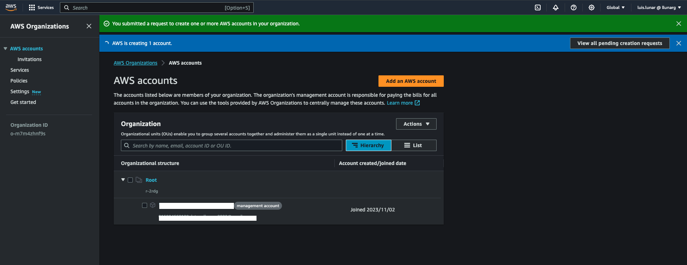
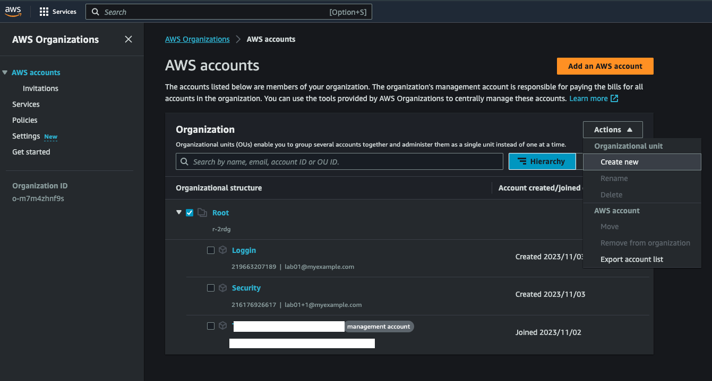
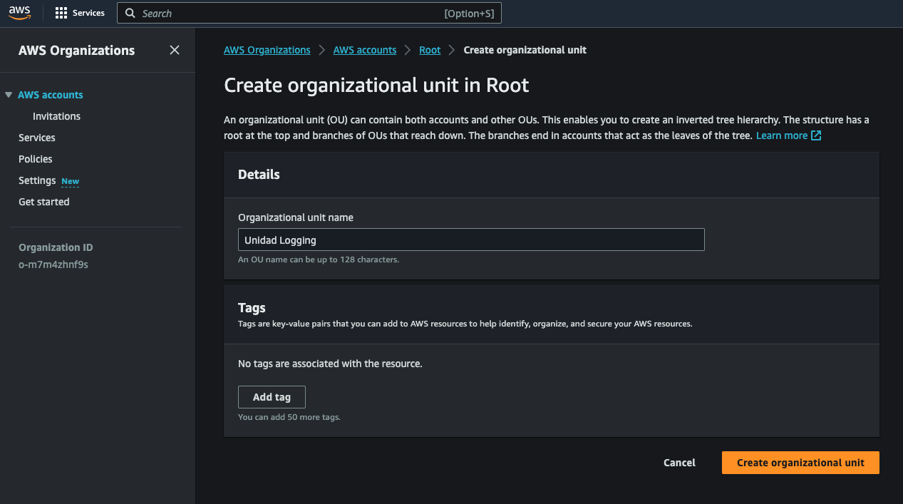
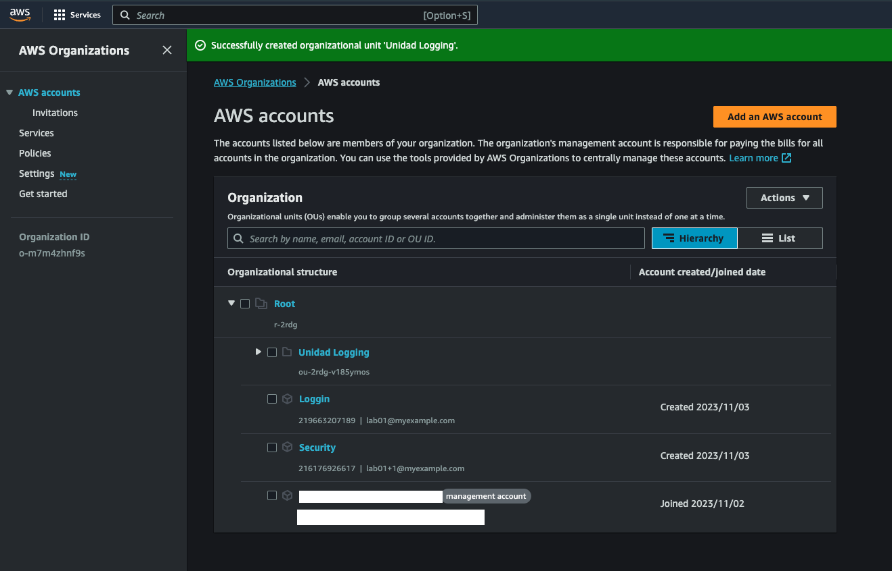
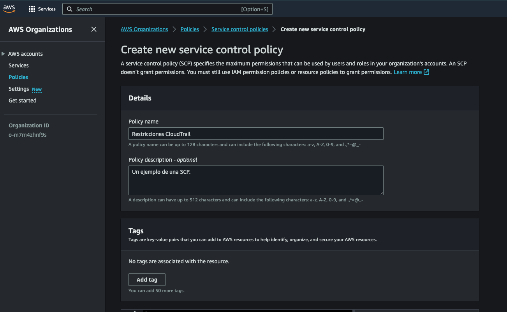
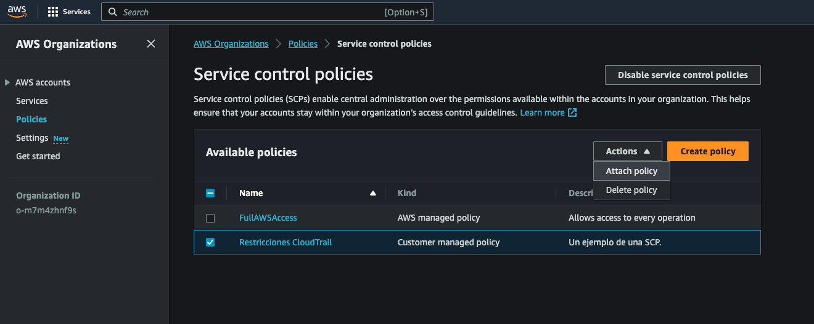

import ReactPlayer from 'react-player'

# Introducción a AWS Organizations

AWS Organizations es un servicio de gestión de cuentas diseñado para consolidar y administrar de manera centralizada múltiples cuentas de AWS. Este servicio no solo permite separar las cargas de trabajo entre diversas cuentas, sino que también ofrece una plataforma unificada para la gestión central de cuentas y cargas de trabajo de AWS. Un aspecto crucial de AWS Organizations es su capacidad para implementar políticas de seguridad a nivel de toda la organización, lo que simplifica considerablemente el cumplimiento de normativas de seguridad y otros requisitos regulatorios.

Además de sus funcionalidades de gestión, AWS Organizations ofrece una característica de facturación consolidada. Esto significa que los costos incurridos por todas las cuentas dentro de la organización se pueden gestionar desde una única cuenta de AWS, facilitando el seguimiento y la asignación de presupuestos. Como administrador de una organización, tienes la libertad de crear nuevas cuentas dentro de tu organización o invitar cuentas existentes a unirse, lo que mejora la flexibilidad y la escalabilidad del entorno de AWS.

## Beneficios de AWS Organizations

### Gestión centralizada de cuentas
Uno de los mayores atractivos de AWS Organizations es la capacidad de gestionar todas las cuentas de AWS de manera centralizada. Esto permite crear nuevas cuentas que forman parte automáticamente de la organización, así como invitar a cuentas existentes para unirse. Además, se pueden adjuntar políticas que afectan a algunas o todas las cuentas, optimizando la administración de recursos y seguridad.

### Facturación consolidada 
AWS Organizations ofrece una funcionalidad de facturación consolidada, lo que facilita la gestión financiera. A través de la cuenta de administración de la organización, es posible consolidar y pagar todas las cuentas miembro. Esto no solo simplifica la facturación sino que también permite un mejor seguimiento del gasto mediante herramientas como AWS Cost Explorer.

### Agrupación jerárquica para necesidades específicas
La posibilidad de agrupar cuentas en unidades organizativas (OUs) añade una capa de flexibilidad para cumplir con necesidades presupuestarias, de seguridad o de cumplimiento normativo. Se pueden adjuntar políticas específicas a cada OU, permitiendo, por ejemplo, el bloqueo de servicios que no cumplan con ciertas regulaciones.

### Políticas para estandarización de etiquetas
AWS Organizations permite implementar políticas de etiquetado para mantener una estandarización en los recursos de todas las cuentas de la organización. Esto es crucial para la gestión efectiva y el seguimiento de recursos.

### Control de IA y aprendizaje automático 
El servicio ofrece políticas para optar por no participar en la recopilación y almacenamiento de datos de servicios de IA y aprendizaje automático de AWS, lo que añade un nivel adicional de control sobre la privacidad y el uso de datos.

### Políticas de respaldo automático 
Con AWS Organizations, se pueden configurar políticas de respaldo que se aplican automáticamente a los recursos en todas las cuentas de la organización. Esto simplifica la tarea de mantener seguros los datos críticos.

### Integración con IAM y otros servicios de AWS 
AWS Organizations se integra de manera fluida con AWS Identity and Access Management (IAM), permitiendo un control más granular a nivel de cuenta y usuario. Además, el servicio es compatible con otros servicios de AWS, lo que amplía su funcionalidad y facilita la gestión de múltiples cuentas.

## Opciones versátiles de acceso a AWS Organizations: Desde la consola hasta la API
AWS Organizations ofrece una gama de métodos para acceder y gestionar sus recursos y configuraciones. Para los usuarios que prefieren una experiencia de usuario visual, la [Consola de Administración de AWS](https://console.aws.amazon.com/organizations/) ofrece una interfaz gráfica en el navegador para realizar todas las operaciones necesarias. En el otro extremo del espectro, las Herramientas de Línea de Comando de AWS, que incluyen la [AWS Command Line Interface (CLI)](https://aws.amazon.com/cli/) y las [AWS Tools for Windows PowerShell](https://aws.amazon.com/powershell/), ofrecen una forma más rápida y posiblemente más conveniente de gestionar recursos, especialmente para aquellos que deseen automatizar tareas mediante scripts.

Para los desarrolladores, AWS Organizations también se integra con los SDKs de AWS, que brindan bibliotecas y código de muestra para una variedad de lenguajes de programación y plataformas. Estos SDKs facilitan tareas como la firma criptográfica de solicitudes y el manejo automático de errores. Además, la API HTTPS Query de AWS Organizations proporciona una opción para quienes necesitan un acceso programático directo al servicio, aunque esta opción requiere la implementación de firmas digitales en las solicitudes.

## Navegando por el laberinto de términos en AWS Organizations: Un vistazo a los conceptos claves
AWS Organizations es un servicio repleto de funcionalidades que ofrece un marco sólido para la gestión centralizada de múltiples cuentas de AWS. Dada su complejidad y extensa terminología, es esencial entender los conceptos clave que forman su columna vertebral. Aunque la lista de términos es extensa, aquí nos centramos en los cinco términos más críticos para obtener un entendimiento sólido del servicio. Además, para facilitar la comprensión, se incluirá un gráfico en este artículo que ilustra cómo todos estos términos y conceptos se entrelazan dentro de la estructura de AWS Organizations.


Fuente: Amazon Web Service (AWS)

**Organization**: Este es el epicentro de todo el ecosistema de AWS Organizations. Es la entidad que agrupa múltiples cuentas de AWS bajo una sola estructura jerárquica que facilita la gestión unificada.

**Root**: Sirve como el contenedor padre para todas las cuentas y OUs (Unidades Organizativas) dentro de una organización. Cualquier política aplicada al 'Root' afectará a todos los elementos que están bajo su jerarquía.

**Organizational Unit (OU)**: Estas son las subentidades dentro del 'Root' que permiten una organización más granular de las cuentas de AWS. Pueden contener otras OUs y cuentas, lo que permite una estructura jerárquica más compleja.

**Service Control Policy (SCP)**: Estas políticas definen los límites máximos de lo que se puede y no se puede hacer dentro de las cuentas y OUs. A diferencia de las políticas de IAM, las SCPs no otorgan permisos sino que actúan como filtros.

**Account**: En AWS Organizations, hay dos tipos de cuentas: la 'Management Account', que es la cuenta principal con derechos administrativos sobre la organización, y las 'Member Accounts', que son las cuentas estándar gestionadas por la cuenta principal.

Para aquellos que buscan profundizar en la gran cantidad de términos y conceptos, recomendamos encarecidamente consultar el [AWS Organizations User Guide](https://docs.aws.amazon.com/organizations/latest/userguide/orgs_introduction.html).

## Control total con Service Control Policies en AWS Organizations

AWS Organizations ofrece un conjunto de herramientas robustas para la administración de múltiples cuentas de AWS, pero uno de sus componentes más críticos son las Service Control Policies (SCPs). Estas políticas permiten a los administradores establecer los máximos permisos disponibles para todas las cuentas dentro de una organización, funcionando como un conjunto de "guardarrails" que limitan lo que los usuarios y roles de IAM en cada cuenta pueden y no pueden hacer.

Es crucial entender que las SCPs no otorgan permisos por sí mismas; más bien, restringen los permisos otorgados por otras políticas de IAM o políticas basadas en recursos. Funcionan en conjunción con estas políticas para formar los permisos efectivos para un usuario o recurso. Y vale la pena mencionar que las SCPs no afectan a la cuenta de administración de la organización, solo a las cuentas miembro.

### SCPs Comunes y sus Aplicaciones

**Restricción de Regiones**
Este SCP es especialmente útil para empresas que operan en regiones geográficas específicas, negando todas las acciones en regiones no utilizadas para simplificar la administración y fortalecer la seguridad.

**Limitación del Tamaño del Recurso**
Ideal para cuentas de desarrollo o pruebas, este SCP establece límites en el tamaño de recursos como instancias EC2 y funciones Lambda.

**Requerimiento de MFA**
Este SCP es fundamental para la seguridad, ya que requiere autenticación multifactor (MFA) para ciertas acciones críticas, como la eliminación de objetos en un bucket S3.

**Prevención de Acceso Raíz**
Este SCP bloquea todas las acciones para el usuario raíz, salvo aquellas que sólo pueden realizarse con acceso raíz.

Estos son solo ejemplos de lo que se puede lograr con SCPs. Para una visión más completa, consulte la AWS Organizations User Guide y el gráfico explicativo que acompaña a este texto, que proporciona una visión clara de cómo se interrelacionan estos diferentes componentes.

Al dominar el uso de SCPs, los administradores pueden ejercer un control granular sobre las cuentas de su organización, asegurando que se adhieran a las mejores prácticas y directrices de seguridad.

## Laboratorio: Configuración y Gestión en AWS Organizations

**Objetivo general:**
En los siguientes pasos, tomarás la iniciativa para configurar, administrar y entender AWS Organizations.

**Consideraciones:**
Para estructurar de manera óptima los recursos en AWS, se configurará una Organización AWS que consistirá en 2 Unidades Organizativas (OUs). Estas OUs agruparán cuentas con denominaciones específicas: Logging y Security. Una vez creadas, cada cuenta será designada a su OU correspondiente.

Cada una de estas cuentas desempeñará roles específicos dentro de la estructura organizativa:

- **Logging Account**: Funcionará como un centro de recolección para Amazon VPC Flow Logs, CloudTrail logs y Config logs.

- **Security Account**: En este espacio, se almacenarán datos de AWS Config. Además, se establecerá un GuardDuty master de Amazon y se activarán alertas relevantes.

Para aquellos interesados en profundizar en las mejores prácticas sobre diseño y estructuración de OUs y cuentas en AWS, recomiendo el artículo: [Best Practices for Organizational Units with AWS Organizations](https://aws.amazon.com/es/blogs/mt/best-practices-for-organizational-units-with-aws-organizations/).

### Creación de cuentas en AWS Organization 
En este paso, practicarás la creación de cuentas AWS para Logging Account y Security dentro del servicio AWS Organization. Las cuentas AWS creadas dentro del AWS Organization sólo pueden ser accedidas utilizando el IAM Role o el usuario root.

Dirígete a la Consola de Administración de AWS y busca el servicio AWS Organizations y **“add an AWS account”**.


- En la página anterior, seleccione **“add an AWS account”**.
- En AWS account name, ingrese el nombre de la cuenta. Para este ejemplo, usaremos “Logging”.
- En **“Email address of the account's owner”**, introduzca la dirección de correo electrónico del propietario de la cuenta, es decir, la dirección de correo electrónico de quien recibirá las comunicaciones en representación de dicha cuenta. Este correo debe ser único a nivel global. Dos cuentas no pueden compartir la misma dirección de correo. A modo de ejemplo, usemos lab01@myexample.com.
- En “IAM role name”, podemos mantener el valor por defecto de OrganizationAccountAccessRole o, si lo prefiere, proporcionar un nombre personalizado.
Finalmente, haga clic en **“Create AWS account”**. Es posible que deba esperar unos minutos y actualizar la página para visualizar la nueva cuenta en la sección Cuentas de AWS.

Repita los pasos previamente mencionados para crear la cuenta denominada "Security". Además, si desea crear varias cuentas AWS utilizando el mismo "email", puede ajustar el "email" añadiendo un "+" seguido de una descripción. (lab01@myexample.com, lab01+1@myexample.com, lab01+2@myexample.com)


Luego, es posible que debamos esperar unos minutos hasta que finalice el proceso de creación de ambas cuentas.



Al finalizar el proceso de creación, tendremos nuestras 2 cuentas creadas, Login y Security.


### Crear las unidades organizativas
En este paso, practicarás la configuración de las Organization Units para las cuentas AWS creadas en la sección anterior. Las Organization Units incluyen Logging y Security. Estas unidades estarán ubicadas dentro del Root, donde se encuentran todas las OUs y cuentas AWS.

Abre la AWS Management Console y busca el servicio AWS Organizations.
Selecciona el Root, haz clic en Actions y luego elige Create new en la sección Organizational Unit.



En la página de **“Create organizational unit in Root”**:
En la sección “**Details**”, proporcione un nombre para la OU (Por ejemplo: Unidad Logging).
Revise la información y haga “clic” en “**Create organizational unit**”



Retornamos a la pantalla anterior y veremos la nueva OU.

### Mueva las Cuentas AWS a la Unidad Organizativa Correspondiente

Dirígete a la Consola de Administración de AWS y encuentra el servicio AWS Organizations utilizando la barra de búsqueda.
Marca la cuenta AWS que deseas mover (Por ejemplo: Logging), haz clic en Acciones y luego selecciona Mover en Cuenta AWS.


En la siguiente pantalla, marca la OU apropiada (Ejemplo: Unidad Logging) y haz clic en Mover cuenta AWS.



Repita los pasos anteriores para la cuenta Security y su Unidad Organizativa.


### Crear las políticas de control de servicios.

Dentro de este procedimiento, estableceremos políticas de control de servicios (SCP) que se vincularán tanto al nodo raíz como a las unidades organizativas, con el objetivo de limitar las acciones que los usuarios de las cuentas de la organización pueden realizar. La SCP inicial asegura que ninguna de las cuentas, ya sea "Logging" o "Security", puedan crear o alterar los registros de AWS CloudTrail previamente configurados. Es importante destacar que la cuenta de administración queda exenta de cualquier SCP. Por tanto, si se necesita crear registros CloudTrail bajo esta política, es esencial hacerlo desde la cuenta de administración.

Antes de trabajar con las políticas de control de servicios (SCP) en la organización, primero es necesario activar este tipo de política. Por defecto, los tipos de políticas no vienen activados. En esta sección, te guiaré en el proceso de habilitación del tipo de política de control de servicios (SCP) para tu organización

Navega a la sección de Políticas y selecciona la opción de Políticas de control de servicios.
Dentro de esta sección, haz clic en la opción que dice “Enable service control policies”. Tras hacerlo, verás un mensaje en verde indicando que has habilitado con éxito la creación de SCP en tu organización.


- Este es un ejemplo de Tag Policy, que podria ayudarte al cumplimiento de una estrategia de taggin que defina tu organización
```json
{
  "Version": "2012-10-17",
  "Statement": [
    {
      "Sid": "DenyCreateWithoutEnvironmentTag",
      "Effect": "Deny",
      "Action": "s3:CreateBucket",
      "Resource": "*",
      "Condition": {
        "StringNotEquals": {
          "aws:RequestTag/Environment": [
            "Development",
            "Testing",
            "Production"
          ]
        }
      }
    }
  ]
}
```

- Esta otra SCP de ejemplo, deniega la creacion de un Bucket S3 que no cumpla con las condiciones de etiquetado
```json
{
  "tags": {
    "Environment": {
      "tag_key": {
        "@@assign": "Environment"
      },
      "tag_value": {
        "@@assign": [
          "Development",
          "Testing",
          "Production"
        ]
      },
      "enforced_for": {
        "@@assign": [
          "ec2:instance",
          "secretsmanager:*"
        ]
      }
    },
    "Owner": {
      "tag_key": {
        "@@assign": "Owner"
      },
      "tag_value": {
        "@@assign": [
          "*"
        ]
      },
      "enforced_for": {
        "@@assign": [
          "ec2:instance",
          "secretsmanager:*"
        ]
      }
    }
  }
}
```

Con las políticas de control de servicios ya activadas en tu organización, estás listo para establecer las tres políticas requeridas para este proceso.


Ahora vamos a configurar la SCP que restringe modificaciones en CloudTrail.
Dirígete a la sección **“Policies”** y selecciona la opción de **“Service control policies”**.
Una vez allí, opta por la opción **“Create policy”**.


En la casilla **“Policy name”**, escribe 'Restricciones CloudTrail'.



Dentro del apartado de **“Edit statement”**, buscamos la opción que dice **“statement1”** y hacemos click en **“remove”**.


Dentro del apartado de **“Edit statement“**, busca y selecciona “CloudTrail” en la lista de servicios disponibles. Posteriormente, marca las acciones que desees limitar, como **AddTags, CreateTrail, DeleteTrail, RemoveTags, StartLogging, StopLogging y UpdateTrail**. En la parte derecha, selecciona la opción para “Add a resource”. Define CloudTrail y marca **“All resources”**, luego confirma con **“Add resource”** y elija **“Create Policy”**
A la izquierda, podrás visualizar la estructura de la política que acabas de definir, tendrá un aspecto similar a la siguiente:


**Asociar las políticas al nodo raíz y a las unidades organizativas**

La página de “Service control policies” muestra que tenemos 2 SCP disponibles. Hacemos clic (botón de opción) en la política que hemos creado **“Restricciones CloudTrail”**. Luego dentro de “Actions” tomamos la opción “Attach policy” y seleccionamos el nodo “root” de esta forma la politica se aplicará a todas las unidades organizativas que se encuentren por debajo de ella.




### Probar las políticas de la organización.

Ahora puedes iniciar sesión como usuario en cualquiera de las cuentas creadas e intentar realizar acciones diversas de configuración de Cloud Trail, deberán ser negadas.

## Laboratorio: Configuración de Switch Role Account

<div className="video__wrapper">
    <ReactPlayer className="video__player" controls height="100%" url="https://youtu.be/PZGr11y0DoY?si=Vf2yFDxNr7s0PMoQ&t=142" width="100%" />
</div>

## Siguientes pasos
- [Desmitificando una estrategia multicuenta](https://d1.awsstatic.com/events/Summits/reinvent2023/ARC324-R_Demystifying-a-multi-account-strategy-REPEAT.pdf)
- [Organización de su entorno de AWS mediante varias cuentas](https://docs.aws.amazon.com/es_es/whitepapers/latest/organizing-your-aws-environment/organizing-your-aws-environment.html)
- [Evaluación de cuentas para AWS Organizations](https://aws.amazon.com/es/solutions/implementations/account-assessment-for-aws-organizations/)
- [Cloud Foundations solutions](https://aws.amazon.com/es/solutions/cloud-foundations/)
- [Service Control Policy examples](https://github.com/aws-samples/service-control-policy-examples)

## Referencias
- [Documentación de AWS Organizations y AWS Account Management](https://docs.aws.amazon.com/es_es/organizations/)
- [Documentación de AWS Control Tower](https://docs.aws.amazon.com/es_es/controltower/)
- [Strategies for consolidating AWS environments](https://aws.amazon.com/es/blogs/mt/strategies-for-consolidating-aws-environments/?nc1=h_ls)
- [Best Practices for Organizational Units with AWS Organizations](https://aws.amazon.com/es/blogs/mt/best-practices-for-organizational-units-with-aws-organizations/)
- [Lab - AWS Single Sign-On for Organizations](https://000012.awsstudygroup.com/)