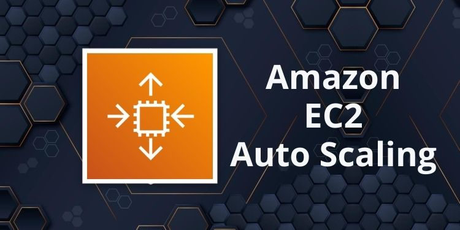
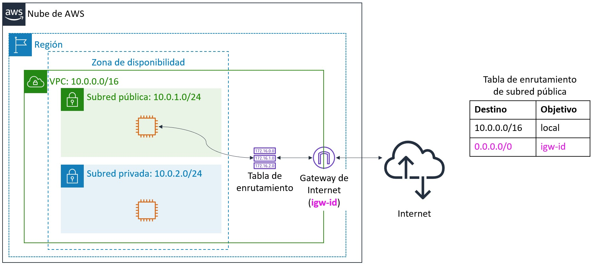
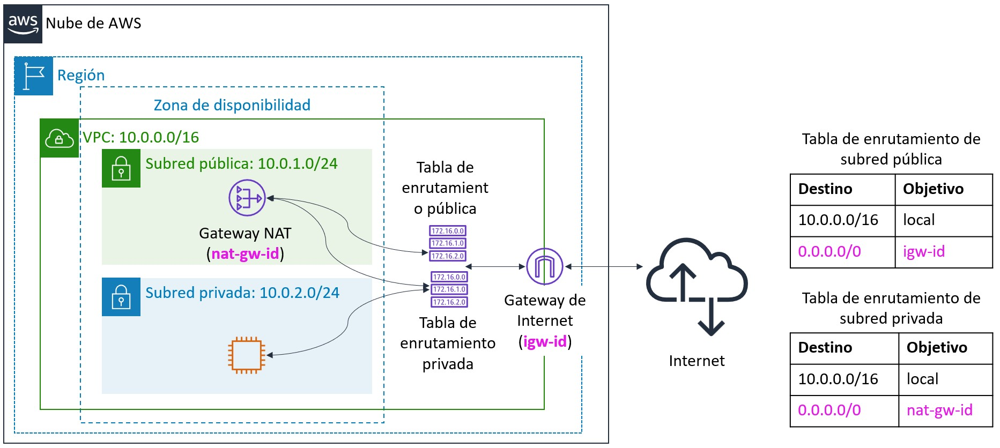
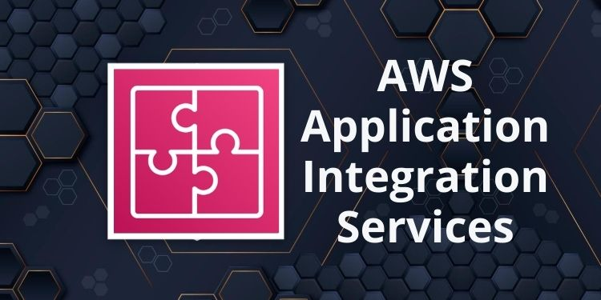
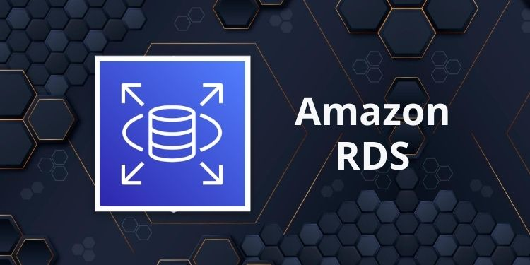
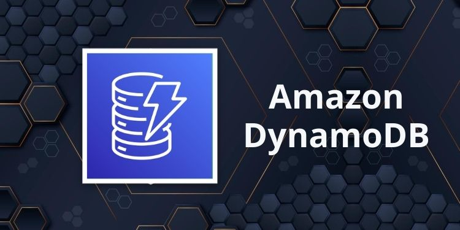
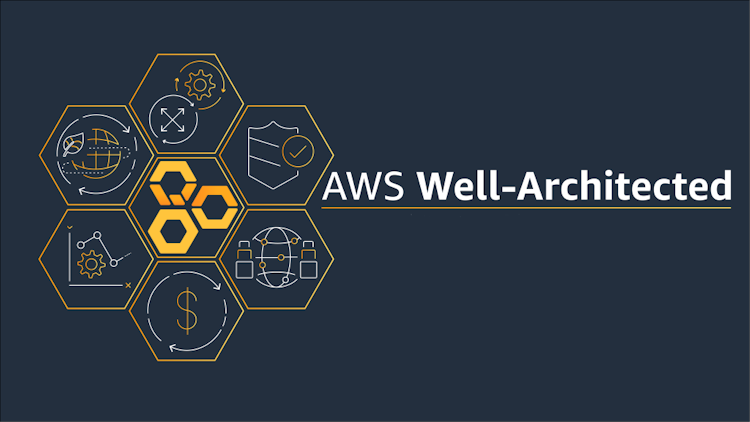

import ReactPlayer from 'react-player';

# ☁️ Introducción a Amazon Web Services

[Amazon Web Services (AWS)](https://aws.amazon.com/es/what-is-aws/)  es una plataforma en la nube que ofrece un amplio conjunto de productos globales basados en Cloud. Estos productos se entregan a través de Internet, y permiten el acceso bajo demanda a recursos informáticos, de almacenamiento, de red, de base de datos y otros recursos de TI para utilizar en diferentes proyectos, así como las herramientas para administrarlos. A un solo clic se puede aprovisionar y lanzar recursos de AWS. Los recursos estarán listos para que los utilicemos en cuestión de minutos.

AWS ofrece una gran flexibilidad permitiendo realizar nuevas configuraciones y actualizaciones bajo demanda, escalar de forma ascendente o descendente automáticamente para cumplir con los patrones de uso y optimizar el gasto. La facturación de los servicios de AWS se convierte en un gasto operativo en lugar de un gasto de capital. 

Los servicios de AWS están diseñados para trabajar en conjunto para poder desarrollar cualquier tipo de aplicación o carga de trabajo.

## Modelo de Precios, Pagos y Soporte en AWS

### Modelo de Precios
AWS tiene tres generadores fundamentales de costos: `cómputo`, `almacenamiento` y `transferencia de datos de salida`. Estas características varían ligeramente en función del producto y el modelo de precios de AWS que elijamos. 

En la mayoría de los casos, no se aplican cargos por la transferencia de datos de entrada ni por la transferencia de datos entre otros servicios de AWS dentro de la misma región de AWS. Existen algunas excepciones, así que asegúrese de verificar las tarifas de transferencia de datos antes de empezar a utilizar el servicio de AWS.

Las transferencias de datos de salida se acumulan entre todos los servicios y, luego, se cobran según la tarifa para ese tipo de transferencia. Este monto aparece en el extracto mensual como AWS Data Transfer Out (Transferencia de datos de salida de AWS). Para más información [Precios](https://aws.amazon.com/es/pricing/)

### ¿Cómo se paga en AWS?

AWS ofrece una gran variedad de servicios en la nube. Solo se paga por la cantidad exacta de recursos que realimente necesitamos. Esta forma de pago se puede sintetizar de la siguiente forma:
* `Pagar por lo que se utliza` - Pagamos solo por los servicios que utilizamos, sin grandes gastos iniciales
* `Pagar menos si se reserva` - Si realizamos reservas de computo, se reduce el precio pudiendo llegar hasta un 75% menos
* `Pagar menos cuanto más se utilice` - Se obtienen descuentos por volumen de utilización de un servicios
* `Pagar aún menos a medida que AWS crece` - Desde 2006, AWS ha bajado los precios 75 veces

Para ayudar a los nuevos clientes de AWS a comenzar a utilizar la nube, AWS ofrece una capa de uso gratuita (la capa gratuita de AWS) durante 1 año como máximo. La capa gratuita de AWS se aplica a determinados servicios y opciones. Para más información https://aws.amazon.com/free

### Soporte en AWS

AWS ofrece 5 planes de soporte

* `Basic` Support ofrece lo siguiente:
    * Acceso al servicio al cliente, a la documentación, a los documentos técnicos y a los foros de soporte las 24 horas, todos los días.
    * Acceso a seis comprobaciones principales de Trusted Advisor.
    * Acceso al panel de estado del servicio.

* `Developer` Support ofrece recursos para clientes que realizan pruebas o tareas de desarrollo iniciales en AWS, así como para clientes que hacen lo siguiente:
    * Acceder a la orientación y al soporte técnico.
    * Exploren cómo poner a AWS en funcionamiento con rapidez.
    * Utilizar AWS para cargas de trabajo o aplicaciones que no sean de producción.

* `Business` Support ofrece recursos a los clientes que ejecutan cargas de trabajo de producción en AWS y a los clientes que hacen lo siguiente:
    * Ejecutar una o más aplicaciones en entornos de producción.
    * Tengan varios servicios activados o realizan un uso intensivo de servicios principales.
    * Depender de que sus soluciones comerciales estén disponibles y sean escalables y seguras.

* `Enterprise On-Ramp` Support ofrece recursos a los clientes que ejecutan cargas de producción o críticas para la empresa en AWS, así como a los clientes que desean lo siguiente:
    * Concentrarse en la administración proactiva para mejorar los niveles de eficiencia y disponibilidad.
    * Crear y utilizar cargas de trabajo que sigan las prácticas recomendadas de AWS.
    * Utilizar los conocimientos de AWS para admitir implementaciones y migraciones.
    * Contar con un grupo de gerentes técnicos de cuentas para proporcionar orientación proactiva y coordinar el acceso a los programas y a los expertos de AWS.

* `Enterprise` Support ofrece recursos a los clientes que ejecutan cargas de trabajo críticas y empresariales en AWS, así como a los clientes que desean lo siguiente:
    * Concentrarse en la administración proactiva para mejorar los niveles de eficiencia y disponibilidad.
    * Crear y utilizar cargas de trabajo que sigan las prácticas recomendadas de AWS.
    * Utilizar los conocimientos de AWS para admitir implementaciones y migraciones.
    * Contar con un director de cuentas técnicas (TAM) que ofrezca experiencia técnica para toda la gama de servicios de AWS y que comprenda en detalle su caso de uso y arquitectura tecnológica. El director de cuentas técnicas es el punto de contacto principal para las necesidades continuas de soporte.

Para más información [Compara los planes de AWS Support](https://aws.amazon.com/es/premiumsupport/plans/?nc=sn&loc=1)

##  Infraestructura Global

La `infraestructura global de AWS` se diseñó y se creó para ofrecer un entorno informático en la nube `flexible, confiable, escalable y seguro` con un rendimiento de red global de alta calidad.

Para más información [Infraestructura Global](https://aws.amazon.com/es/about-aws/global-infrastructure/)

### Regiones en AWS

AWS posee regiones en todo el mundo. Una región es una zona geográfica y es un grupo de centros de datos.
Cada región posee 2 o más zonas de disponibilidad y los datacenter están separados entre ellos con 100 km de distancia en su mayoría (como mínimo 50 km).

Ahora, la gran pregunta es, `¿Cómo elegir una región de AWS?` para responderla debemos evaluar lo siguiente:
* Cumplimiento de los requisitos legales y de gobernanza de datos: los datos nunca salen de una región sin un permiso explícito.
* Proximidad a los clientes: latencia reducida. 
* Servicios disponibles en una región: los nuevos servicios y las nuevas funciones no están disponibles en todas las regiones.
* Precios: los precios varían de una región a otra y son transparentes en la página de precios del servicio.

### Zonas de disponibilidad
Cada `región` cuenta con varias zonas de disponibilidad.
Cada `zona de disponibilida`d es una partición completamente aislada de la infraestructura de AWS.
* Actualmente hay 102 zonas de disponibilidad en todo el mundo.
* Las zonas de disponibilidad constan de centros de datos discretos.
* Están diseñadas para el aislamiento de errores.
* Se interconectan con otras zonas de disponibilidad mediante redes privadas de alta velocidad.
* Podemos eligir que zona de disponibilidad utilizaremos.
* AWS recomienda replicar los datos y recursos entre las zonas de disponibilidad para obtener mayor resiliencia.

### Zonas Locales (Local Zones)

AWS Local Zones es un tipo de implementación de infraestructura que permite tener una muy baja latencia sobre los servicios que se despliegan en ella.

Las Zonas locales dependen de una región (Ej.: la de Argentina depende del Norte de Virginia (us-east-1)) y solo hay algunos servicios de AWS en las local zones, para ver el detalle [Servicios Local Zone](https://aws.amazon.com/es/about-aws/global-infrastructure/localzones/features/?nc=sn&loc=2)

Actualmente en Latinoamérica hay en Lima, Perú - Santiago, Chile - Buenos Aires, Argentina ... Proximamente Bogotá, Colombia ... más información [Zonas Locales](https://aws.amazon.com/es/about-aws/global-infrastructure/localzones/locations/?nc=sn&loc=3&refid=fc81dabe-57e1-4c46-8d33-cfd3acf1ef08)

## Servicios Infomática (Compute Services) en AWS

AWS brinda una gran variedad de servicios informáticos para satisfacer las necesidades de las organizaciones, como Amazon Elastic Compute Cloud (EC2), Amazon Elastic Container Service (ECS), Amazon Elastic Container Service for Kubernetes (EKS), Amazon Lightsail, AWS Batch y AWS Lambda, por nombrar algunos. Para algunos servicios como Amazon EC2, se contratan con modalidad IaaS, mientras que para otros, como Lambdas son de tipo SaaS.

Para más información sobre los servicios de informática, podes ir a 
 [Informática - Compute](https://aws.amazon.com/es/products/compute/)

### Elastic Compute Cloud - EC2

La sigla EC2 en Amazon significa `Elastic Compute Cloud`:
* `Elastic` se refiere a la capacidad para aumentar o reducir fácilmente la cantidad de servidores que se ejecutan para admitir una aplicación de manera automática, así como para aumentar o reducir el tamaño de los servidores existentes.
* `Compute` hace referencia al motivo principal por el que la mayoría de los usuarios ejecutan servidores: poner aplicaciones en ejecución o procesar data. Estas acciones requieren recursos informáticos, incluida la capacidad de procesamiento (CPU) y la memoria (RAM). 
* `Cloud` se refiere al hecho de que las instancias EC2 ejecutadas se alojan en la nube. 

`Amazon EC2` brinda máquinas virtuales en la nube y ofrece la gestión sobre el sistema operativo Windows o Linux que se ejecuta en la instancia. Es compatible con la mayoría de los sistemas operativos de servidores, incluidos Windows 2012, 2016, 2019 y 2022; Red Hat; SuSE; Ubuntu; y Amazon Linux.

Un sistema operativo que se ejecuta en una máquina virtual suele denominarse sistema operativo invitado para distinguirlo del sistema operativo host. El sistema operativo host se instala directamente en un hardware que aloja una o más máquinas virtuales.

Con `Amazon EC2`, podemos lanzar cualquier cantidad de instancias de todo tipo de tamaños en cualquier zona de disponibilidad y local zone del mundo y lograrlo en cuestión de minutos. Las instancias se lanzan a partir de `imágenes de Amazon Machine (AMI)`, que son plantillas de máquinas virtuales. 

Podemos controlar el tráfico desde y hacia las instancias a través de los grupos de seguridad.

Para más información [EC2](https://aws.amazon.com/es/ec2/)

### Grupo de Auto escalado EC2 - EC2 Auto Scalling Groups

`Auto Scaling Groups` ayuda a mantener la disponibilidad de las aplicaciones y 
 permite agregar o eliminar instancias EC2 de forma automática según las políticas definidas y las comprobaciones de estados. Cuando especificamos las políticas de escalado, el `Auto Scaling Group` puede lanzar o terminar instancias en función del aumento o la disminución de la demanda de la aplicación. 

`Auto Scaling Group` se integra a Elastic Load Balancing: registra automáticamente nuevas instancias al balanceador de carga para distribuir el tráfico entrante entre las instancias. 

Los `Auto Scaling Group` permiten crear arquitecturas de alta disponibilidad que abarcan varias zonas de disponibilidad en una región. Si una zona de disponibilidad pasa a estar en mal estado o no está disponible, `Auto Scaling Group` lanza nuevas instancias en una zona de disponibilidad que no se haya visto afectada. Cuando la zona de disponibilidad en mal estado vuelve a tener un estado correcto, `Auto Scaling Group` redistribuye automáticamente las instancias de la aplicación de manera uniforme entre todas las zonas de disponibilidad designadas. 

Para más información [Auto Scaling Groups](https://docs.aws.amazon.com/autoscaling/ec2/userguide/index.html)

### AWS Lambda

AWS ofrece muchas opciones de informática. Por ejemplo, Amazon EC2 brinda máquinas virtuales. Otro ejemplo, Amazon ECS y Amazon EKS son servicios de informática basados en contenedores.

Sin embargo, también existe otro enfoque para la informática que no requiere que aprovisionemos o administremos ningún servidor. Este tercer enfoque se conoce a menudo como informática sin servidor. 

AWS Lambda es un servicio de informática sin servidor basado en eventos. Este servicio permite ejecutar código sin disponibilizar ni administrar servidores. 

Se puede crear una función de Lambda, que es el recurso de AWS que contiene el código que subimos. Luego, configuramos la función Lambda que se debe desencadenar, ya sea en forma programada o como respuesta a un evento. El código solo se ejecuta cuando se desencadena.

Se paga por el tiempo que utilicemos los recursos informáticos y no se cobrará nada cuando el código no se ejecute.

⚠️ Lambda admite varios runtimes, pero tiene un timeout de 15 min. Además para que la función lambda acceda a otros servicios de AWS, es necesario un rol de ejecución.

Para más información [Lambda](https://aws.amazon.com/es/lambda/)

### AWS Step Functions

Es un servicio de orquestación, que brinda flujos de trabajo visuales. 
Nos ayuda a enfocarnos en la lógica de negocios de mayor valor, además que soporta patrones de flujos de trabajo como reintentos y branching

#### Máquinas de estado

- Flujo de trabajo serverless
- Compuestos de pasos llamados estados
- Duración máxima de 1 año
- Flujos de trabajo: estándar y express
- Iniciado a través de API Gateway, EventBridge, Lambda
- Amazon States Language (ASL)
- Rol de IAM se utiliza para los permisos

#### ¿Cuándo usar un servicio de orquestación?

- ¿Tienes una aplicación que abarca varios servicios de AWS?
- ¿Es importante la secuencia de interacción del servicio?
- ¿Tu aplicación administra el estado entre AWS y las llamadas a los servicios?
- ¿Tienes un flujo de trabajo de aplicación que requiera intervención humana?
- ¿Tu aplicación contiene patrones de flujo de trabajo como árboles de decisión, procesamiento paralelo, reintentos y manejo de errores?

#### Casos de Uso

- Procesamiento de datos (archivos, video, imágenes)
- Orquestación de microservicios
- Machine learning 
- Automatización de seguridad
- Computación de alto rendimiento

¿Quieres conocer más de AWS Step Functions y las funciones Lambda? Revisa este video para conocer, acerca de los diferentes casos de uso que podemos aplicar utilizando Step Functions y además ver una demo de como utilizarlas desde la consola de AWS.
<ReactPlayer controls url='https://www.youtube.com/watch?v=rvhOKO-XROs&ab_channel=AWSUserGroupGuatemala' width="auto" />  

💎 Revisa el código de lo demo en el siguiente repo ➡️ https://github.com/alfalfita/demo-step-functions

## Servicios de Almacenamiento en AWS

Los servicios de almacenamiento en AWS (Storage Services) permiten el almacenamiento de los datos tanto a nivel de bloque como de objetos. A continuación veremos los más relevantes

Para más información [Almacenamiento](https://aws.amazon.com/es/products/storage/)

### Amazon Simple Storage Service (S3) - Buckets de S3

`Amazon S3` es una solución administrada de almacenamiento en la nube que se diseñó para brindar un escalado sin problemas y 99,999999999 % (11 nueves) de durabilidad. Además de poder almacenar prácticamente todos los objetos dentro de un bucket, 
 permite realizar operaciones de escritura, lectura y eliminación de los objetos almacenados en el bucket. Los `nombres de los buckets son universales` y deben ser únicos entre todos los nombres de buckets existentes en Amazon S3. Los objetos pueden ser de hasta 5 TB. De forma predeterminada, en Amazon S3 los datos se almacenan de forma redundante en varias instalaciones y en diferentes dispositivos.

Los datos que almacenamos en Amazon S3 no están asociados a ningún servidor en particular. Además, no necesita administrar ninguna infraestructura. Podemos colocar tantos objetos como desiemos en S3. S3 contiene billones de objetos y, con regularidad, tiene picos de millones de solicitudes por segundo. 

Los objetos pueden ser prácticamente cualquier archivo de datos, como imágenes, videos o logs de servidores. Como S3 admite objetos de hasta varios terabytes de tamaño, permite almacenar instantáneas de bases de datos como objetos. S3 ofrece acceso de baja latencia a los datos a través de Internet mediante HTTP o HTTPS, para que poder recuperar datos en cualquier momento y desde cualquier lugar. También podemos acceder a S3 de forma privada a través de un punto de enlace en el VPC. 

De forma predeterminada, no se comparte ninguno de sus datos públicamente. También podemos cifrar los datos en tránsito y se habilita el cifrado del lado del servidor en sus objetos por defecto.

Podemos acceder al bucket de S3 a través de la consola de administración de AWS, de forma programática a través de la API y los SDK, o con soluciones de terceros que utilizan la API o los SDK de AWS.

Para más información [S3](https://aws.amazon.com/es/s3/)

### Amazon EBS (Elastic Block Storage) - Almacenamiento de Bloque elástico

`Amazon EBS` permite crear volúmenes de almacenamiento individuales y asociarlos a una instancia EC2. Amazon EBS ofrece `almacenamiento a nivel de bloques`, en el cual los  volúmenes se replican automáticamente dentro de su zona de disponibilidad. 

`Amazon EBS` está diseñado para proporcionar almacenamiento a nivel de bloques duradero y desmontable (que es como un unidad de disco externo) para instancias EC2. Como se encuentran asociados de forma directa a las instancias, podemos proporcionar baja latencia entre la ubicación en la que están guardados los datos y en la que se ejecuta la instancia.  

Una `copia de seguridad` de un volumen de EBS se denomina `instantánea` (snapshot). La primera instantánea se denomina instantánea de referencia. Cualquier otra instantánea posterior a la de referencia captura solo lo que es diferente de la instantánea anterior (el diferencial). 

Entre los usos de los volúmenes de EBS, se incluyen los siguientes: 
* Volúmenes de arranque y almacenamiento para instancias de EC2
* Almacenamiento de datos con un sistema de archivos determinado
* Bases de Datos
* Aplicaciones 

Para más información [EBS](https://aws.amazon.com/es/ebs/)

### Amazon EFS

Amazon EFS es un servicio completamente administrado que facilita la configuración y el escalado del almacenamiento de archivos en la nube de AWS. Puede utilizar Amazon EFS para crear un sistema de archivos para big data y análisis, flujos de trabajo de procesamiento multimedia, administración de contenido, servidores web y directorios principales. 

Puede crear sistemas de archivos que sean accesibles para las instancias de Amazon EC2 a través de una interfaz de sistema de archivos (mediante las API estándares de operaciones de E/S de archivos del sistema operativo). Estos sistemas de archivos admiten semántica de acceso completo al sistema de archivos, como la consistencia sólida y el bloqueo de archivos.

Los sistemas de archivos de Amazon EFS pueden escalar automáticamente desde gigabytes hasta petabytes de datos sin necesidad de aprovisionar almacenamiento. Miles de instancias de Amazon EC2 pueden acceder al mismo tiempo a un sistema de archivos de Amazon EFS. Este servicio, además, está diseñado para proporcionar un rendimiento uniforme a cada una de estas instancias. Amazon EFS también está diseñado para ofrecer alta disponibilidad y larga duración. Con Amazon EFS, no hay tarifas mínimas ni costos de configuración; solo paga por el almacenamiento que utiliza.

Para más información [EFS](https://aws.amazon.com/es/efs/)

## Servicios de Redes / Networking en AWS

Estos servicios permiten la definición de redes y la conectivadad dentro de AWS. También permiten la conectividad con redes On-Premise u otras nubes.

Para más información [Redes](https://aws.amazon.com/es/products/networking/)

### Amazon Virtual Private Cloud - Amazon VPC

`Amazon Virtual Private Cloud (Amazon VPC)` es un servicio que permite desplegar una sección de la nube de AWS aislada lógicamente (denominada nube virtual privada o VPC) donde podemos lanzar sus recursos de AWS.

Amazon VPC permite controlar los recursos de red virtual, incluye la selección del direcciones IP de la red, la creación de subredes y la configuración de tablas de enrutamiento y gateways de red. Se pueden utilizar protocolos IPv4 e IPv6 para acceder de forma segura a los recursos y las aplicaciones.

También permite personalizar la configuración de red del VPC. Por ejemplo, podemos crear una subred pública para los servidores web que tengan acceso a Internet de forma pública. También podemos implementar una subred privada para sistemas de backend (como los servidores de aplicaciones o de bases de datos) sin acceso a Internet.

### Subredes

Después de crear una VPC, puede dividirla en una o más subredes. Una subred es un intervalo de direcciones IP en una VPC. Las subredes pertenecen a una única zona de disponibilidad. Puede crear subredes en diferentes zonas de disponibilidad para conseguir un nivel elevado de disponibilidad. En general, las subredes se clasifican como públicas o privadas. Las subredes públicas tienen acceso directo a Internet, pero las subredes privadas, no.

### Internet Gateway - Gateway de Internet

Un Internet gateway es un componente del VPC escalable, redundante y altamente disponible que permite la comunicación entre instancias en el VPC e Internet. 
El Internet gateway se configura a nivel regional y se configura 1 para todo el VPC. 

Para hacer pública una subred, debemos asociar una Internet Gateway al VPC y agregar una ruta en la tabla de enrutamiento para enviar el tráfico que no es local a Internet (0.0.0.0/0) a través del Internet gateway. 

### NAT Gateway - Gateway de traducción de las direcciones de red (NAT)
 
Un NAT Gateway permite a las instancias de la/s subred/es privada/s conectarse a Internet o a otros servicios de AWS, a la vez que impide a Internet iniciar una conexión con esas mismas instancias. 

Para crear un NAT Gateway, debemos especificar la subred pública en la que se debe ubicar la NAT Gateway. También debemos especificar una dirección IP elástica para asociar a la NAT Gateway cuando lo creamos (se puede crear en el momento de creación también). Una vez creado el NAT Gateway, debemos actualizar la tabla de enrutamiento que esté asociada a una o más de las subredes privadas para que dirija el tráfico orientado hacia Internet a través del NAT Gateway. De esta manera, las instancias con subredes privadas podrán comunicarse hacia Internet. 

### Grupos de Seguridad / Security Group

Un Grupo de Seguridad (Security Group) funciona como un firewall virtual de la instancia para controlar el tráfico de entrada y salida. Los grupos de seguridad actúan al nivel de las instancias, pero no en la subred. Por lo tanto, cada instancia en una subred de un VPC puede  tener asignado más de un grupo de seguridad diferente.

Basicamente, un grupo de seguridad representa una forma de filtrar el tráfico hacia las instancias.

### NACL - Network ACL - Lista de Control de Acceso a la red

Una lista de control de acceso a la red (Network ACL) es una capa de seguridad opcional en el VPC. Actúa como firewall para controlar el tráfico que entra y sale de una o más subredes. Para agregar una capa de seguridad adicional al VPC, podemos configurar Network ACL con reglas similares a los grupos de seguridad.

Cada subred en el VPC debe estar asociada a una Network ACL. Si no asociamos una subred de forma explícita a una Network ACL, la subred se asociará automáticamente a la Network ACL predeterminada. Podemos asociar una Network ACL a varias subredes; sin embargo, una subred solo se puede asociar a una Network ACL a la vez. Cuando se asocia una Network ACL a una subred, se elimina la asociación anterior. 

### Elastic Load Balancig - Balanceo de Carga elastico

`Elastic Load Balancing` es un servicio de AWS que distribuye el tráfico entrante de las aplicaciones o la red entre varios destinos, como las instancias de Amazon Elastic Compute Cloud (Amazon EC2), los contenedores, las direcciones de protocolo de Internet (IP) y las funciones de Lambda, en una única zona de disponibilidad o en varias. Elastic Load Balancing escala el balanceador de carga a medida que el tráfico dirigido a la aplicación cambia con el tiempo. Puede escalar automáticamente a la mayoría de las cargas de trabajo. 

Elastic Load Balancing está disponible en 2 sabores:

* `ALB` - El `balanceador de carga de aplicaciones` (`Application Load Balancer`) opera a nivel de aplicación (capa 7 del modelo OSI). Dirige el tráfico a los destinos (instancias de EC2, contenedores, direcciones IP y funciones de Lambda) en función del contenido de la solicitud. Es ideal para el balanceo de carga HTTP y HTTPS. El ALB brinda direccionamiento de solicitudes avanzadas en arquitecturas de aplicaciones modernas, como los microservicios y aplicaciones basadas en contenedores. El ALB simplifica y mejora la seguridad de las aplicaciones al garantizar que se utilicen en todo momento los protocolos y cifrados de la capa de conexión segura (SSL) o de la seguridad de la capa de transporte (TLS).

* `NLB` - El `balanceador de carga de red` (`Network Load Balancer`) opera a nivel de capa de transporte (capa 4 del modelo OSI) y dirige las conexiones a los destinos (instancias EC2, microservicios y contenedores) en función de los datos del protocolo IP. Funciona bien para balancear la carga del tráfico TCP y UDP. El NLB es capaz de gestionar millones de solicitudes por segundo mientras mantiene latencias bajas. El NLB está optimizado para gestionar patrones de tráfico de red repentinos y volátiles. 

Para más información [Elastic Load Balacing](https://aws.amazon.com/es/elasticloadbalancing/)

## Servicios de Integración de Aplicaciones

Los servicios de integración de aplicaciones de AWS son una familia de servicios que permiten la comunicación desacoplada entre aplicaciones.

Estos servicios proporcionan desacoplamiento para microservicios, sistemas distribuidos y aplicaciones serverless.

Los servicios de integración de aplicaciones de AWS permiten conectar aplicaciones sin necesidad de escribir código personalizado para permitir la interoperabilidad.

Las aplicaciones desacopladas pueden interoperar a la vez que son tolerantes a fallas o sobrecargas de cualquier componente individual.

### Amazon SQS - Simple Queue Service - Servicio Simple de Colas

Amazon Simple Queue Service (Amazon SQS) es un servicio de cola de mensajes completamente administrado que permite desacoplar los componentes de una aplicación para que se ejecuten de forma independiente. Permite a las aplicaciones web poner en cola los mensajes que genera un componente de la aplicación para que los consuma otro componente. 

Una cola es un repositorio temporal de mensajes que están esperando ser procesados. Los mensajes se almacenan hasta que se procesan y eliminan (de 1 a 14 días; la cantidad predeterminada es 4 días). Los mensajes pueden contener hasta 256 KB de texto en cualquier formato. Amazon SQS funciona a gran escala y procesa miles de millones de mensajes al día. Almacena todas las colas de mensajes y los mensajes dentro de una región única de AWS en alta disponibilidad con varias zonas de disponibilidad redundantes. Los mensajes pueden enviarse y leerse de manera simultánea.

Podemos compartir de manera segura colas de Amazon SQS anónimamente o con cuentas de AWS específicas. También podemos restringir el uso compartido de colas por dirección IP y por hora del día. Los mensajes de las colas de SQS están cifrados con cifrado del lado del servidor (SSE) mediante claves administradas en AWS Key Management Service (AWS KMS). Amazon SQS descifra los mensajes únicamente cuando se envían a un consumidor autorizado.

Para más información [SQS](https://aws.amazon.com/es/sqs/)

### Amazon SNS - Simple Notification Service - Servicio de Notificaciones Simple

Amazon Simple Notification Service (Amazon SNS) es un servicio web que podemos utilizar para configurar, operar y enviar notificaciones desde la nube. El servicio sigue el paradigma de mensajería de publicación/suscripción (pub/sub), donde las notificaciones se entregan a los clientes mediante un mecanismo push. Amazon SNS está diseñado para aplicaciones grandes y exigentes, y permite a las aplicaciones publicar un número ilimitado de mensajes en cualquier momento.
 
Cuando utilizamos Amazon SNS, creamos un tema y establecemos políticas que restringen quién puede publicar el tema o suscribirse al mismo. Un publicador envía mensajes a los temas que ha creado o en los que tiene permiso para publicar. Amazon SNS compara el tema con una lista de los suscriptores que se han suscrito a él y entrega el mensaje a cada uno de ellos. Cada tema tiene un nombre único que define el punto de enlace de Amazon SNS para que los publicadores puedan publicar mensajes y los suscriptores puedan registrarse para recibir notificaciones. Los suscriptores recibirán todos los mensajes que están publicados en los temas a los que se suscriban; por tanto, todos ellos recibirán los mismos mensajes.

Amazon SNS admite temas cifrados. Después de publicar mensajes en temas cifrados, Amazon SNS utiliza claves (CMK) para cifrar los mensajes. Las CMK son los recursos principales de AWS KMS. Amazon SNS admite CMK administradas tanto por el cliente como por AWS. 

Cuando Amazon SNS recibe sus mensajes, se cifran usando un algoritmo Advanced Encryption Standard-Galois/Counter Mode (AES-GCM) de 256 bits. Los mensajes cifrados se almacenan de forma redundante en varios servidores y centros de datos, y en varias zonas de disponibilidad para mayor durabilidad. Los mensajes se descifran justo antes de que se entreguen a los puntos de enlace suscritos.

Amazon SNS admite los siguientes protocolos de transporte para la entrega de mensajes:

* Email o email-JSON: los mensajes se envían por email a las direcciones registradas. Email-JSON envía notificaciones como objetos JSON y emails envía mensajes de email basados en texto.
* Protocolo HTTP o HTTPS: durante el registro de suscripción, los suscriptores especifican una URL. Los mensajes se entregan a través de una solicitud HTTP POST a la URL especificada.
* Servicio de mensajes cortos (SMS): los mensajes se envían como mensajes de texto SMS a números de teléfono registrados.
* Colas de Amazon SQS: los usuarios especifican una cola estándar de SQS como punto de enlace. Amazon SNS pondrá en cola un mensaje de notificación en la cola especificada. 
* Funciones de AWS Lambda: los mensajes se entregan a las funciones de AWS Lambda, que administran las personalizaciones de los mensajes, posibilitan la persistencia de los mensajes o se comunican con otros servicios de AWS.

Para más información [SNS](https://aws.amazon.com/es/sns/?nc1=h_ls)

### EventBridge

Amazon EventBridge incorpora una secuencia de datos en tiempo real de sus propias aplicaciones, aplicaciones de software como servicio (SaaS) y servicios de AWS. Después direcciona esos datos a destinos, como por ejemplo AWS Lambda. 

Un evento indica un cambio en el entorno. Puede ser un entorno de AWS, un servicio,  aplicación SaaS, una aplicacion o un servicio personalizado. Por ejemplo, Amazon EC2 genera un evento si el estado de una instancia EC2 cambia de pendiente a en ejecución, y Amazon EC2 Auto Scaling genera eventos cuando lanza o termina instancias. 
También podemos programar eventos que se generan de forma periódica.

Los usuarios pueden acceder al bus, las reglas y los eventos predeterminados que tienen en EventBridge. 

Podemos establecer reglas de direccionamiento para determinar el lugar al que se enviarán los datos con el objetivo de crear arquitecturas de aplicaciones que reaccionen en tiempo real a todos los orígenes de datos. 

Una regla empareja eventos entrantes y los direcciona a destinos para su procesamiento. Con una única regla podemos efectuar el direccionamiento hacia varios destinos, los cuales se procesan en paralelo. Las reglas no se procesan en un orden concreto. Permitiendo a las distintas partes de una organización buscar y procesar los eventos que les interesen. Con una regla podemos personalizar JSON que se envía al destino pasando solo ciertas partes o sobrescribiéndolo con una constante.

Para más información [EventBridge](https://aws.amazon.com/es/eventbridge/)

## Servicios de Bases de Datos

Los Servicios de Bases de datos son aquellos que brindan la posibilidad de acceder, almacenar y actualizar datos de la forma que las diferentes aplicaciones lo necesitan.

Podemos utilizar los siguientes tipos de bases de datos:

* `Relacional` (Amazon Aurora, Amazon RDS, Amazon Redshift)
* `Clave-valor` (Amazon DynamoDB)
* `En memoria` (Amazon ElasticCache, Amazon MemoryDB for Redis)
* `Documento` (Amazon DocumentDB)
* `Columna ancha` (Amazon Keyspaces)
* `Grafos` (Amazon Neptune)
* `Series` Temporales (Amazon Timestream)
* `Contabilidad-Blockchain` (Amazon Quantum Ledger Database Services)

Para más información [Bases de Datos](https://aws.amazon.com/es/products/databases/)

### Amazon RDS - Amazon Relational Database Service - Servicio de Bases de Datos Relacionales

`Amazon RDS` es un servicio administrado que permite configurar y operar una base de datos relacional en AWS. 

`Amazon RDS` permite centrarse en las aplicaciones para poder proporcionarles rendimiento, alta disponibilidad, seguridad y compatibilidad necesarias. Con este servicio, podemos enfocarnos principalmente en los datos y en optimizar la aplicación. 

Las instancias y el almacenamiento de base de datos difieren en cuanto a las características de rendimiento y el precio, permitiendo adaptar el costo y el rendimiento a las necesidades de la base de datos. Cuando eligimos crear una instancia de base de datos, primero tenemos que especificar qué motor de base de datos vamos a ejecutar. Actualmente, Amazon RDS admite seis motores bases de datos relacionales: 
* MySQL
* Amazon Aurora
* Microsoft SQL Server
* PostgreSQL
* MariaDB
* Oracle

Para más información [RDS](https://aws.amazon.com/es/rds/)

### Amazon Aurora

`Amazon Aurora` es una base de datos relacional compatible con MySQL y PostgreSQL que se fue creada por AWS. Combina el rendimiento y la disponibilidad de las bases de datos comerciales de alta gama con la simplicidad y la rentabilidad de las bases de datos de código abierto. 

El uso de `Amazon Aurora` permite reducir los costos de la base de datos y, al mismo tiempo, mejorar la fiabilidad y disponibilidad de la base de datos. 

Aurora está diseñado para automatizar tareas cuya realización requieren mucho tiempo, como el aprovisionamiento, la implementación de parches, la realización de copias de seguridad, la recuperación, la detección de errores y la reparación.

Existen versiones Serverless de `Amazon Aurora` permitiendo disponilibilizar únicamente por lo que se va a utilizar. También permite Green/Blue deployment de nuevas versiones del motor de base de datos.

Para más información [Aurora](https://aws.amazon.com/es/rds/aurora/)

### DynamoDB

`DynamoDB` es un servicio de base de datos NoSQL rápido y flexible para todo tipo de aplicaciones que requieren una latencia uniforme de milisegundos a escala. 

Amazon administra toda la infraestructura subyacente de datos para este servicio y almacena los datos de manera redundante en varias zonas dentro de una región como parte de la arquitectura tolerante a errores. Con `DynamoDB`, podemos crear tablas y elementos. Podemos agregar elementos a una tabla. El sistema particiona los datos automáticamente y cuenta con el almacenamiento de tablas necesario para cumplir con los requisitos de carga de trabajo. No existe ningún límite práctico respecto de la cantidad de elementos que se pueden almacenar en una tabla. 

Uno de los beneficios de las `bases de datos NoSQL` es que los elementos de la misma tabla pueden tener atributos diferentes. Esto brinda flexibilidad para agregar atributos a medida que la aplicación evoluciona. Podemos almacenar elementos con formatos más nuevos junto a otros con formatos más viejos en la misma tabla, sin tener que realizar migraciones de esquemas.

El almacenamiento puede crecer según las necesidades de la aplicación. Todos los datos de `DynamoDB` se almacenan en unidades de estado sólido (SSD), y su lenguaje de consulta simple permite un rendimiento de las consultas uniforme y baja latencia. DynamoDB permite aprovisionar el rendimiento de lectura o escritura que necesita para cada tabla. A medida que aumenta la cantidad de usuarios en una aplicación, las tablas de `DynamoDB` se pueden escalar para admitir el incremento de las solicitudes de lectura y escritura mediante el aprovisionamiento manual. Pudiendo también 
 habilitar el escalado automático para que `DynamoDB` monitoree la carga de la tabla e incremente o disminuya el rendimiento aprovisionado de manera automática. 

La posibilidad de crear `tablas globales` permite generar réplicas de manera automática en las regiones de AWS que elijamos, el cifrado en reposo y la visibilidad del tiempo de vida (TTL) de los elementos. 

Para más información [DynamoDB](https://aws.amazon.com/es/dynamodb/)

## Servicios de Monitoreo y Alarmas

Los servicios de Monitoreo y Alarmas en AWS son los que permite poseer métricas de los servicios de AWS (Cloudwatch Metrics, X-Ray) como también tener archivos de registro (CloudWatch Logs).

También permite la creación de Alarmas basados en las métricas y registros definiendo humbrales (CloudWatch Alarms)

Para más información [Cloudwatch](https://aws.amazon.com/es/cloudwatch/)
### CloudWatch Metrics

Amazon `CloudWatch Metrics`, recopila y procesa los datos sin formato de diferentes servicios de AWS, y los convierte en métricas legibles casi en tiempo real. Estas estadísticas se registran durante un periodo de 15 meses, de forma que podamos acceder a la información histórica y obtener una mejor perspectiva acerca del rendimiento de los servicio y/o aplicación web.

De forma predeterminada, el monitoreo básico, envía datos de métricas a CloudWatch en intervalos de 5 minutos. Para enviar los datos de las métricas a CloudWatch cada 1 minuto, podemos habilitar el monitoreo detallado según el servicio. 

Asimismo, Amazon Cloudwatch permite crear "nuevas métricas" instalando el agente de Cloudwatch en las instancias de EC2 (por ejemplo para el monitoreo de la memoria RAM).

Para más información [Cloudwatch Metrics](https://docs.aws.amazon.com/es_es/AmazonCloudWatch/latest/monitoring/working_with_metrics.html)
### CloudWatch Alarms

Las `CloudWatch Alarms` se utilizan para inicializar una acción con respecto a un valor. Una alarma controla una métrica a lo largo de un periodo de tiempo especifico y realiza una o varias acciones en función del valor de la métrica verificando un umbral a lo largo del tiempo.

La acción más común es enviar una notificación a un topico de SNS o a una política de Auto Scaling. 

Las alarmas de CloudWatch no invocan acciones simplemente porque se encuentren en un estado determinado. El estado debe haber cambiado y haberse mantenido durante un número determinado de periodos.

Para más información [Cloudwatch Alarms](https://docs.aws.amazon.com/es_es/AmazonCloudWatch/latest/monitoring/AlarmThatSendsEmail.html)

### CloudWath Logs

Amazon `CloudWatch Logs` permite monitorear y registrar los problemas nuestros sistemas y aplicaciones mediante archivos de log personalizados, de aplicación y de 
 sistemas existentes.

Podemos utilizar Amazon CloudWatch Logs para monitorearr, almacenar y agrupar archivos de log enviados por instancias de EC2, CloudTrail, Route 53 y otras fuentes.

Los registros de CloudTrail pueden enviarse a CloudWatch Logs para ser monitoreados 
 en tiempo real.

`CloudWatch Logs` permite realizar filtros de métricas para analizar los datos de registro que genera una métrica de CloudWatch.

Para más información [Cloudwatch Logs](https://docs.aws.amazon.com/es_es/AmazonCloudWatch/latest/logs/WhatIsCloudWatchLogs.html)

## Buenas prácticas Cloud en AWS

AWS, desde sus comienzos, acompaña a los clientes recomendando las mejoras de formas para adoptar la nube y de cómo mejorar las cargas de trabajos que llevamos a la nube. Adicional a esto, posee mejores prácticas por cada uno de sus servicios.

A continuación hablaremos de los dos Framewroks más importantes, Cloud Adoption Framework (CAF) y Well Architected Framework (WAF).

### AWS Cloud Adoption Framework - AWS CAF 

AWS Cloud Adoption Framework (AWS CAF) aprovecha la experiencia y las mejores prácticas de AWS para contribuir a la transformación digital y la aceleración de los resultados empresariales a través del uso innovador de AWS. 

AWS CAF identifica las capacidades organizativas necesarias que ayudan a transformar el negocio con éxito para aprovechar al máximo la nube. Estas capacidades brindan orientación sobre prácticas recomendadas que ayudan a mejorar la preparación de la organización para ir a la nube. AWS CAF agrupa las capacidades en 6 perspectivas: Negocio, Personas, Gobernanza, Plataforma, Seguridad y Operaciones. Cada perspectiva abarca un conjunto de capacidades que ayudarán a una mejor adopción de la nube. 

Con AWS CAF podemos identificar y dar prioridad a las oportunidades de transformación digital, evaluar y mejorar la preparación para ir a la nube y evolucionar de manera iterativa el plan de desarrollo de la organización.

Para más información [CAF](https://aws.amazon.com/es/cloud-adoption-framework/)

### AWS Well Architecture Framework 

El AWS Well-Architected Framework ayuda a comprender los pros y contras en cómo crear aplicaciones en AWS.Usar este Framework ayuda a conocer las mejores prácticas de arquitectura para diseñar y operar cargas de trabajo seguras, fiables, eficientes, rentables y sostenibles en la nube de AWS. Nos brinda una forma de medir de forma coherente las arquitecturas con respecto a las prácticas recomendadas e identificar áreas de mejora. El proceso de revisión de una arquitectura nos permite desafiar las decisiones de arquitectura actuales para poder mejorarlas, no es un mecanismo de auditoría. 

A partir de la experiencia en la ayuda en la creación de multiples arquitecturas, AWS identificó prácticas recomendadas y estrategias básicas para la arquitectura de sistemas en la nube.

El WAF de AWS a través una serie de preguntas básicas ayudan a comprender si una arquitectura específica se ajusta a las prácticas recomendadas en la nube. El WAF proporciona un enfoque coherente para evaluar los sistemas en función de las cualidades que se esperan de sistemas modernos basados en la nube, así como las medidas correctivas necesarias para alcanzar dichas cualidades. 

Para más información [WAF](https://aws.amazon.com/es/architecture/well-architected/)
