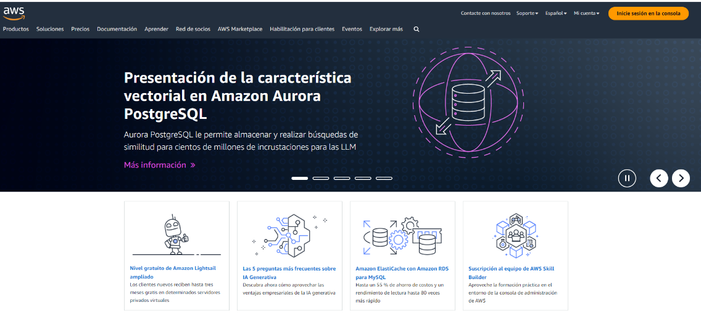

# 🌥️  Introducción a Computación en la Nube

## ¿Qué es la nube?

Para poder entender ¿qué es la nube?, es necesario entender algunos conceptos básicos en el área tecnología.
A continuación se presenta una lista de conceptos con una breve explicación y un enlace con información mas detallada de cada uno:

+ **Servidor**: En términos simples, es una PC con hardware diseñado específicamente para soportar grandes cargas de trabajo. Y brindar una confiabilidad muchísimo mayor a las empresas.

+ **Centro de datos**: Es un grupo de servidores y equipos necesarios para interconectar esos servidores y que los usuarios puedan llegar a los mismos. Además puede incluir equipos para asegurar la red y equipos de almacenamiento. En general un centro de datos cuenta con baterías (UPS) que permiten al centro de datos mantenerse encendido una cantidad de tiempo limitada a la capacidad de estas baterías. 

+ **Redes**: Es la conexión entre servidores y los equipos de los usuarios. Nos permite compartir recursos dentro del contexto de la red (servidores, impresoras, discos/almacenamiento compartido, etc.)
[Aquí mas información sobre este concepto](fundamentos/redes)

Aclarados estos conceptos, es momento de comenzar a entender qué es _la nube_.

Probablemente, la primera vez que escuchamos sobre _la nube_, imaginamos algo así:

E inmediatamente surgen preguntas del tipo: _¿Cómo puede ser que guarden los datos allí? ¿No se pierden? ¿Cómo acceden a esa información? o expresiones como "Eso debe ser complicadísimo!"_

En tecnología, cuando se habla de "la nube", se está haciendo referencia a un grupo de servicios a los que se acceden a través de internet y estos servicios son suministrados por alguno de los proveedores de nube que existen: (Amazon Web Services [AWS], Microsoft Azure, Google Cloud, etc.)

¿Qué hacen estos proveedores? En términos muy simplificados, brindan una página web desde la cuál (una vez que creamos una cuenta) se puede dar de alta múltiples servicios y estos ya estarán listos para usar.

Por ejemplo: https://aws.amazon.com/es/

## Tipos de servicios en la nube

Una vez generada la cuenta en el sitio web del proveedor de nube seleccionado, la siguiente pregunta será ¿Para qué sirve esa cuenta?

Antes de responder a esta pregunta, haremos un repaso de una lista de servicios de nube utilizados en el día a día y que probablemente un usuario no los identifique como **servicios en la nube**.

### Email
 Día a día millones de usuarios acceden a los servicios de proveedores de email, como por ejemplo: [GMail](https://www.google.com/intl/es-419/gmail/about/) , [Outlook.com](https://www.microsoft.com/es-es/microsoft-365/outlook/email-and-calendar-software-microsoft-outlook) y/o [iCloud Mail](https://www.icloud.com/mail), etc. y seguramente estos usuarios no lo identificaron como un servicio en la nube, aunque sacan provecho de sus ventajas. Estos servicios son fácil de usar, una persona se crea una cuenta e inmediatamente comienza a utilizarlo y además, no requiere de la instalación de un software en los dispositivos personales para poder utilizarlos. Sólo se necesita un navegador web.

### Almacenamiento de archivos
 [iCloud](https://www.icloud.com), [Google Drive](https://www.google.com/intl/es-419/drive/), [One Drive](https://www.microsoft.com/es-ar/microsoft-365/onedrive/online-cloud-storage), [Dropbox](https://www.dropbox.com/official-teams-page), son servicios que se utilizan en el día día para almacenar fotos, archivos, documentos, backups, etc. Sólo necesitamos crear una cuenta y ya se puede empezar a usar el servicio.

En muchos casos existe un modelo gratuito, en el cual se puede almacenar una cantidad limitada de información (en general suficiente para cualquier uso normal), y se cuenta con la posibilidad de ampliar ese límite con una suscripción con un costo relativamente bajo que se abona de forma mensual.

Entonces…¿para qué sirven estos servicios en la nube?

Y aquí la mejor forma de responder es imaginandosé las siguientes situaciones: 

_¿Qué pasa si se pierde el pendrive en el que se encuentran guardados los archivos? ¿Qué pasa si se rompe? ¿Qué sucede si ese pendrive es robado? y yendo a un ejemplo menos extremista… Ese pendrive es olvidado en algún lugar y se necesita un archivo que se encuentra almacenado allí y la distancia no deja posibilidad de ir a buscarlo en ese momento._

Aquí aparecen esas ventajas de _la nube_, estos servicios brindan:
- **confidencialidad** la información almacenada sólo puede ser accedida por el dueño de la misma y los usuarios autorizados por el mismo dueño
- **accesibilidad** se puede acceder a la información desde cualquier lugar y/o dispositivo, sólo se necesita tener acceso a internet
- **confiabilidad** los archivos no serán modificados, ni se perderán. El proveedor del servicio se encarga de proteger los archivos y contar con respaldos ante un desastre.

Estos ejemplos de servicios _cloud_ refieren a servicios básicos y/o suficientes para tareas rutinarias del día a día.

Pero cuándo el desafío crece, estos dejan de ser suficiente, porque hace falta otro tipo de servicios.

Para subir una **página web**, es necesario contar con un servidor y que el mismo esté publicado a intenet. Esto en la nube es muy simple, una vez creada la cuenta en alguno de los proveedores, existen varias soluciones para poder tener publicada una página web.

Cuándo hace falta una **solución para almacenar archivos compartidos** de la empresa en un único lugar, que se puedan segmentar los accesos, que los archivos tengan alta disponibilidad y estén protegidos. Aquí también la nube ofrece muchísimos tipos de solución para dejar decidir al usuario cuál es la mas conveniente.

Cuando hace falta **desplegar un servidor** y se necesita que esté activo rapidamente, aquí también la nube ofrece la posibildad de generarlo. 
Y aquí hay varios puntos a destacar:
- El nuevo servidor puede estar operativo en cuestión de minutos, no requiere de una inversión inicial, y si no se necesita más o nos equivocamos, se puede eliminar y sólo se pagará por el tiempo que se usó.
- Y esto se pone aún mejor, muchos proveedores de nube ofrecen una **capa gratuita** para poder hacer pruebas y conocer las diferentes soluciones que el servicio brinda.
Los servicios en la nube permiten hacer pruebas de concepto, y hasta permiten equivocarse a un costo bajo o hasta sin costo en algunos casos.

## Modelos de despliegue

Existen 3 tipos de modelo de nube y cada una contará con ventajas y/o desventajas.
En primer lugar, existe el modelo de nube pública, y se refiere a cuando sólo se hace uso de los servicios/recursos en cualquiera de los proveedores de nube.
 Nota: Es importante aclarar que el hecho de que se lo llame nube pública, NO indica que la información almacenda allí es pública, simplemente se utiliza ese nombre porque se está utlizando un servicio público. Pero la información y recursos sólo pueden ser accedidos por los usuarios que tienen un permiso específico para poder llegar a esos recursos.
En el caso de la nube privada, todos los recursos e información, se encuentran dentro del centro de datos local (on premise).
Y finalmente el modelo de nube híbrida, es una combinación de los dos modelos anteriores. En este modelo la nube privada y la nube pública trabajan de forma conjunta, compartiendo recursos entre si.

| Nube pública | Nube privada | Nube híbrida |
| ------------ | ------------ | ------------ |
| Mayor escala, costos más bajos | Escalabilidad y flexibilidad limitadas | Si no se quiere migrar todos los servicios a la nube cuando existe información crítica. |
| Difícil integración con "Legacy" | Riesgo de obsolescencia | Se reduce el tiempo y los gastos empleados en el mantenimiento del sistema |
| Se desea una menor carga de TI | Si no se quiere compartir ningún recurso | Si se quiere trabajar con aplicaciones específicas en una nube privada y, en los momentos de máxima demanda optar por utilizar una nube pública |
    
