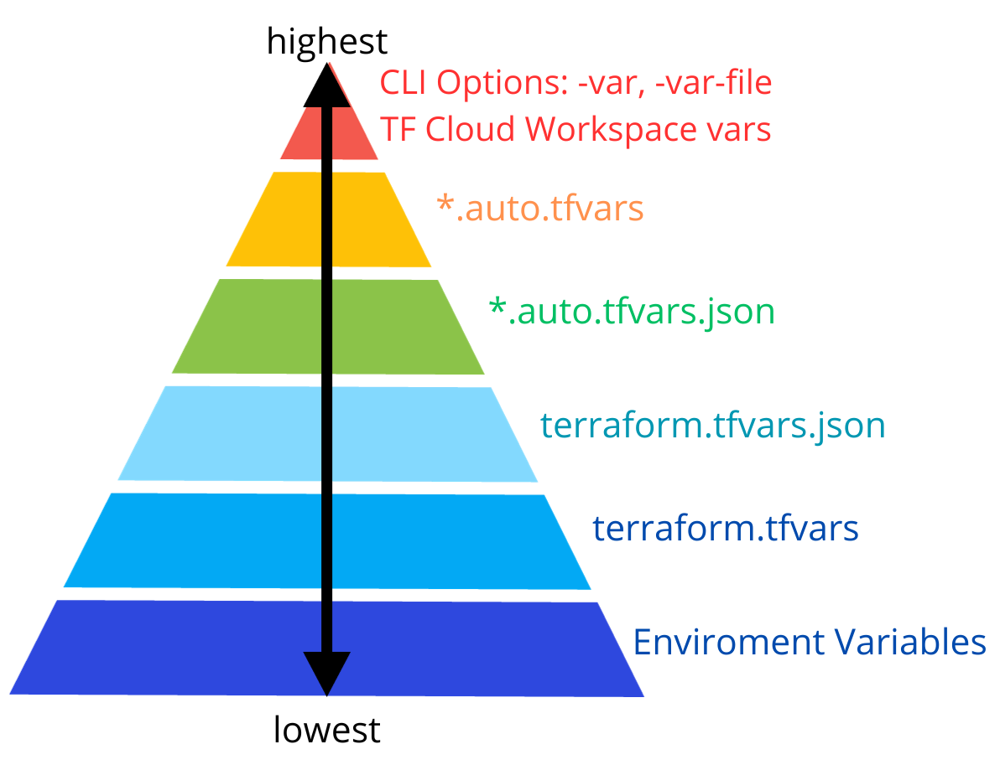

import ReactPlayer from 'react-player'  
import Tabs from '@theme/Tabs';  
import TabItem from '@theme/TabItem';

## ¿Qué es terraform?

Terraform es una herramienta de código abierto creada por HashiCorp y escrito en el lenguaje de programación Go. El código Go se compila en un único binario (o mejor dicho, un binario para cada uno de los sistemas operativos soportados) llamado terraform.

En este vídeo, cortito y al pie, tienes la explicación de que ¿qué es terraform?


### ¿Cómo instalar terraform?

Esta [guía](https://developer.hashicorp.com/terraform/downloads) contiene la instalación de terraform en tu local para cualquier sistema operativo.

# Fundamentos de terraform

Terraform ayuda a implementar infraestructura desde casi cualquier computadora, y no necesita ejecutar ninguna infraestructura adicional para que esto suceda. Eso es porque debajo del capó, el binario de terraform hace llamadas API en su nombre a uno o más proveedores, como AWS y más.

Terraform aprovecha los mecanismos de autenticación que ya está utilizando con esos proveedores (por ejemplo, las claves API que ya tiene para AWS), analiza tu código, traduce en una serie de llamadas API a los proveedores de nube especificados en el código, y realiza esas llamadas API de la manera más eficiente posible.

## La sintaxis Haschicorp Configuration Language (HCL)

La sintaxis HCL le permite crear configuraciones, que son archivos de texto que especifican qué infraestructura desea crear.  
Estas configuraciones son la `infraestructura como código`.

La estructura HCL de terraform es muy sencilla de entender, se expresa en formato `json`

```
<block name> <resource type> <resource name> {
    key1 = value1 //argumento
    key2 = value2 //argumento
}
```

Vamos a entender la estructura HCL

```
resource "local_file" "pet" { // "local" -> representa al provider y "file" -> el recurso de ese provider
    filename = "/root/pets.txt" // dentro de los {} vienen todos los argunmentos que miraremos mas adelante
    content = "Hola mundo" // cabe decir, que cada provider, maneja sus propios argumentos
}
```

Un ejemplo de un recurso de bloque terraform usando como provider a `ÀWS`

```
resource "aws_vpc" "example" { //"aws" -> representa el provider y "vpc" -> el recurso a utilizar
  cidr_block = "10.0.0.0/16" // argumento del recurso a desplegar
}
```

💡 Interpretamos el siguiente bloque de recurso, como un bloque que va a declarar la configuracion de un recursos llamado VPC del proveedor AWS.

## Usando Providers en Terraform

Los providers en terraform son un plugin que habilita la interacción con una API, esto incluye proveedores de nube como AWS, GCP, Azure entra oras, como proveedores de Software-as-a-Services. En esta [guía](https://registry.terraform.io/browse/providers) encontrarás todos los providers que puedes usar en terraform.

El primer comando que se usa para desplegar los recursos declarados en nuestros archivos de terraform es `terraform init`. Con este comando se descargan el o los providers de una ruta similar a esta: [registriy.terraform.io/hashicorp/local](https://registry.terraform.io/providers/hashicorp/local/latest) donde [registry.terraform.io](https://registry.terraform.io/) es el **hostname**, `hashicorp` el **Organizational Namespace** y `local` el **type**.

Ejemplo de `terraform init`


### Configuración del directorio

Antes de continuar, estos son algunos de los archivos terraforms que debes conocer:

`main.tf` archivo de configuración principal que contiene la definición de los recursos.

`variables.tf` contiene la declaración de las variables que son leídas por los recursos declarados en main.tf

`outputs.tf` contiene la salida de los recursos, cada recursos en terraform genera un id del recurso o de sus argumentos.

`provider.tf` contiene la definición de los providers.

`terraform.tfvars` contiene la definición de tus variables que son leidas desde el `variables.tf`. Usar este archivo es una buena práctica.

`locals.tf` son valores con nombre que se pueden asignar y utilizar en su código. Sirve principalmente para reducir la duplicación dentro del código Terraform.

`data.tf` este objeto permite extraer y obtener datos desde diversas fuentes locales o de servicios externos para ser usados en los archivos de Configuración de Terraform

⚠️ No te preocupes por entender el qué y cómo de los archivos terraform, los veremos a mas detalle en adelante. Pero, si familizarizate con los nombres de dichos archivos, ya que los verás en cualquier proyecto terraform.

### Trabajar con múltiples providers

Puedes hacer uso de múltiples providers en tu proyecto terraform. Por ejemplo puedes tener un un proyecto donde debas hacer uso de proveedores como AWS, Okta y Docker.

Para lograrlo, debes especificar todos estos proveedores en el archivo `providers.tf`. En este archivo es donde va la configuración de todos los proveedores que usarás para tu proyecto.

Entonces la configuración de los recursos de esos proveedores, podría ir en un archivo llamado `main.tf` o algún otro (mas adelante entenderás el porqué) y desde aquí busca obtener la información del proveedor al leer tu archivo `providers.tf`.

Ejemplo de tu estructura de archivos terraform hasta este punto:

```
resource "local_file" "pet" {
  filename = "/root/pets.txt"
  content = "Hola mundo"
}

resource "random_pet" "my-pet" {
  prefix = "Mrs"
  separator = "."
  length = "1"
}

terraform {
  required_providers {
    local = {
      source = "hashicorp/local"
      version = "2.4.0"
    }

    random = {
      source = "hashicorp/random"
      version = "3.5.1"
    }
  }
}
```

☝️ Si te fijas, en main.tf estamos declarando dos recursos de dos providers diferentes, entonces en nuestro `providers.tf` tenemos la obligación de mencionarlo.

### Cómo instalar terraform

Esta [guía](https://developer.hashicorp.com/terraform/downloads) contiene la instalación de terraform en tu local para cualquier sistema operativo.

## Configuración del directorio

- `main.tf` archivo de configuración principal que contiene la definición de los recursos
- `variables.tf` contiene la declaración de las variables
- `outputs.tf` contiene la salida de los recursos
- `provider.tf` contiene la definición de los providers
- `terraform.tfvars` contiene la definición de las variables que son leidas desde el `variables.tf`
- `locals.tf` contiene la definición de las variables locales
- `data.tf` contiene bloques de datos que se utilizan para obtener información de recursos existentes o datos externos que no están bajo el control de Terraform, como consultas a API, datos de otros sistemas, o información de infraestructura existente.

## Tipos de Variables en Terraform

### Variables locales

Las variables locales se definen en el bloque `locals` dentro del archivo de configuración de Terraform.  
Tienen un alcance limitado al módulo o bloque donde se definen.

```
locals {
  instance_count = 3
  instance_type  = "t2.micro"
}
```

### Variables de entrada

Las variables de entrada se pueden definir en un archivo .tf (un archivo de variables) o en un módulo.  
Nos permiten proporcionar valores configurables desde fuera del código, lo que permite que el código sea reutilizable y parametrizable.

Las variables de entrada en terraform nos permiten almacenar valores en un archivo llamado `variables.tf` que son instanciadas desde otro archivo como `main.tf` u otro de configuración de recursos.

Por ejemplo, puedes tener un archivo de configuracion con los valores fijos o seteados dentro del código, así:

```
resource "aws_instance" "webserver" { // en este recursos intentamos crear una instancia EC2 en AWS
  ami = "ami-123" // aquií indicamos cual es el ami-id que necesitamos para nuestra instancia
  instance_type = t2.micro // aquí el tamaño de dicha instancia
}
```

Sin embargo, NO es la mejor práctica.

Entonces, ¿cómo mejoramos ese código?, aquí es donde entra en juego las variables de entorno:

```
resource "aws_instance" "webserver" {
  ami = var.ami
  instance_type = var.instance_type
}
```

Gracias a que almacenaste el valor de los argumentos en variables dentro tu archivo `variables.tf`

```
variable "ami" {
  default = "ami-123"
}

variable "instance_type" {
  default = "t2.micro"
}
```

### Variable de salida

Las variables de salida se definen en un archivo .tf o en un módulo y se utilizan para exportar el valor de un bloque de recurso creado por Terraform para que se pueden usar en otros módulos o scripts externos.

```
resource "local_file" "pet" {
    filename = var.filename
    content = "Mi mascota favorita es ${random_pet.my-pet.id}"
}

resource "random_pet" "my-pet" {
  prefix = var.prefix
  separator = var.separator
  length = var.length
}
```
  </TabItem>
<TabItem value="outputs" label="outputs.tf">

```json
output pet-name {
value = random_pet.my-pet.id
description = "Obtiene el valor de Pet ID generado por el recurso random_pet"
}
```
  </TabItem>
  <TabItem value="variables" label="variables.tf">

```json
variable "ami" {
  default = "ami-123"
}

variable "instance_type" {
  default = "t2.micro"
}
```
  </TabItem>
  <TabItem value="provider" label="providers.tf">

```json
terraform {
  required_providers {
    aws = {
      source = "hashicorp/aws"
      version = "5.19.0"
    }
  }
}
```
  </TabItem>
</Tabs>

## Precedencia de Variables

Terraform tiene un sistema de precedencia para determinar cómo se resuelven las variables cuando se utilizan en diferentes contextos. La precedencia se basa en la siguiente jerarquía:



Cuando se resuelven las variables, Terraform sigue esta jerarquía y utiliza el valor con la precedencia más alta.

💡 Se pueden aplicar las variables de diferentes maneras:

- Hacer el `terraform apply` y luego ir escribiendo el valor de cada variable en la terminal. Suponiendo que no especificaste algun archivo con dichas variables
- Se puede aplicar `export TF_VAR_nombrevariable="Valor de variable"` en tu local y al momento de hacer el `terraform apply` Terraform tomara el valor de las variables que exportaste en tu local
- Hacer uso del archivo `terraform.tfvars.json` o `terraform.tfvars`

## Tipos de datos

Se pueden usar diferentes tipos de datos en terraform

- `string`: Representa una cadena de texto

```
name = "mi_instancia"
```

- `number`: Representa valores numéricos enteros o de punto flotante.

```
count = 5
```

- `bool`: Representa valores booleanos, es decir, `true` o `false`.

```
enabled = true
```

- `any` (Cualquier): Este tipo de dato puede contener cualquier tipo de valor, lo que lo hace flexible pero menos seguro en términos de validación de tipos.

```
data = "cualquier_valor"
```

`list`: Representa una colección ordenada de valores. Los elementos de una lista se pueden acceder por su índice.

`map`: Representa una colección de pares clave-valor. Las claves son cadenas y los valores pueden ser de cualquier tipo de dato.

## Atributos de recursos

Cada bloque de recurso nos permite crear un recurso, por ejemplo, con el recurso `random_pet` buscamos crear un recurso para `my-pet` que puede resultar en "Mr. Cat".

Dicho valor, se almacena en un id dentro de terraform, el cual podemos instanciar para poder usar en algún otro recurso:

```
resource "local_file" "pet" {
    filename = var.filename
    // obtenemos el valor del recurso que se almacena en random_pet.my-pet
    content = "Mi mascota favorita es ${random_pet.my-pet.id}"
}

resource "random_pet" "my-pet" {
  prefix = var.prefix
  separator = var.separator
  length = var.length
}
```

## Principales comandos

- Terraform init: Para inicializar el proyecto de Terraform, debes ejecutar el comando terraform init en el directorio donde se encuentra el archivo de configuración de Terraform. Este comando descargará e instalará cualquier proveedor y dependencia  
  que se necesiten.
- Terraform plan: Para planificar los recursos que se crearán con Terraform, ejecuta el comando terraform plan. Esto mostrará una lista de los recursos que se crearán y cualquier cambio que se aplicará a los recursos existentes.
- Terraform apply: Para aplicar los cambios a los recursos existentes o crear nuevos recursos, ejecuta el comando terraform apply. Terraform mostrará una lista de los cambios que se aplicarán y pedirá una confirmación antes de continuar.
- Terraform destroy: Para eliminar los recursos creados con terraform.


### Otros comandos

- `terraform validate`
- `terraform fmt`
- `terraform show`
- `terraform providers`
- `terraform providers mirror <path>` copia la info de los providers en algun archivo de otra ruta
- `terraform output`
- `terraform output <nombre-recurso>`
- `terraform refresh` muestra los cambios, similar al `terraform plan`
- `terraform graph` crea una representacion visual de tus archivos de configuración

## Reglas de ciclo de vida

Estas reglas te permiten personalizar el comportamiento después de la ejecución de un `terraform apply`

Existen 3 tipos de Lifecycle Rules:

- `create_before_destroy` el cual crea el recurso primero y destruye el antiguo después
- `prevent_destroy` el cual previene la destrucción de un recurso, no aplica para el `terraform destroy`
- `ignore changes` el cual ignora cambios en los atributos de recursos que pueden aplicar a algunos o todos

```
resource "local_file" "pet" {
    filename = var.filename
    content = "Mi mascota favorita es ${random_pet.my-pet.id}"

    lifecycle {
        create_before_destroy = true
    }
}

resource "random_pet" "my-pet" {
  prefix = var.prefix
  separator = var.separator
  length = var.length

    lifecycle {
        prevent_destroy = true
    }
}

resource "local_file" "pet" {
    filename = var.filename
    content = "Mi mascota favorita es ${random_pet.my-pet.id}"
    tags = {
        Name = "ProjectA-webserver"
    }
//ignora cambios en atributos especificos
    lifecycle {
        ignore_changes = [
            filename,
            tags
        ]
    }
}

resource "local_file" "pet" {
    filename = var.filename
    content = "Mi mascota favorita es ${random_pet.my-pet.id}"
    tags = {
        Name = "ProjectA-webserver"
    }
// ignora cualquier cambio en cualquiera de los atributos
    lifecycle {
        ignore_changes = all
    }
}
```

## Datasources

Los bloques data sources nos permiten leer infraestructura existente, a diferencia de los bloques de recursos que crean, actualizan y destruyen infraestructura.

```
resource "local_file" "pet" {
    filename = var.filename
    content = data.local_file.dog.content
}

data "local_file" "dog" {
    filename = "/root/dog.txt"
}
```

## Count & For-each

El meta-argumento **count** te permite poder recorrer los elementos dentro de un array y crear la cantidad de recursos que especifiques.

Si te fijas en este bloque de código, tenemos 5 objetos en nuestro recursos de variable.  
Y al declarar _count_ dentro de nuestro bloque de recurso, podemos especificarle cuantos recursos en total queremos que cree en base a los objetos dentro de nuestra variable

```
resource "local_file" "pet" {
    filename = var.filename
    content = var.filename[count.index]

    count = 3 // creara un total de 3 recursos que tomara de la variable
}

variable "filename" {
    default = {
    "/root/pets.txt", //index 0
    "/root/dogs.txt", // index 1
    "/root/cats.txt", // ..
    "/root/cows.txt", // ..
    "/root/ducks.txt" // indenx 4
    }
}
```

También podemos utilizar la `función lenght` que nos permite tomar el total de objetos dentro de nuestra variable, esto nos ayuda a que si queremos añadir mas recursos en el futuro, solo bastaría agregarlas en el array de la variable, y en el próximo terraform apply, se crearan los recursos añadidos.

```
resource "local_file" "pet" {
    filename = var.filename
    content = var.filename[count.index]

    count = lenght(var.filename) // toma el total de valores de var.filena
}

variable "filename" {
    default = {
    "/root/pets.txt",
    "/root/dogs.txt",
    "/root/cats.txt",
    "/root/cows.txt", // nuevo valor añadido
    "/root/ducks.txt" // nuevo valor añadido
    }
}
```

Con `for-each`

```
resource "local_file" "pet" {
    filename = each.value
    for_each = var.filename // recorre cada valor de tu variable y los crea
}

variable "filename" {
    type = set(string) // se usa set

    default = {
    "/root/pets.txt",
    "/root/dogs.txt"
    }
}

resource "local_file" "pet" {
    filename = each.value
    for_each = toset(var.filename) // hace que Terraform convierta a set cuando declaras un list en tu variable
}

variable "filename" {
    type = list(string)
    default = {
    "/root/pets.txt",
    "/root/dogs.txt"
    }
}
```

## Los state en terraform

Se puede tener todo tipo de infraestructura creada en una cuenta de AWS, ya sea que sea haya implementado de forman manual, por Terraform o a través de CLI; entonces, ¿cómo sabe Terraform de qué infraestructura es responsable? Lo sabe, gracias a que Terraform, registra información sobre qué infraestructura creó en un archivo de estado de Terraform.

El estado de terraform es una propiedad que le permite a Terraform saber cuales son los recursos de la infraestructura deseada que declaras en los archivos de configuración y la compara con la infraestructura real en el proveedor con el que estes trabajando.

Con el comando `terraform plan` puedes verificar el resultado de ese versus, para saber con exactitud cuales son los cambios a realizar.

Sin embargo, es cuando se ejecuta el `terraform apply` donde se escribe todo la información de este estado dentro de un archivo llamado `terraform.state` el cual no debes eliminar ni modificar.

Este archivo contiene un formato JSON personalizado que registra una asignación de los recursos de Terraform en sus archivos de configuración.

Supongamos que tenemos lo siguiente:

```
“resource "aws_instance" "webserver" {
  ami           = "ami-0fb281ca2d3203ac1"
  instance_type = "t2.micro"
}
```

Al ejecutar `terraform apply` podríamos obtener un archivo `terraform.tfstate` similar a este:

```
{
  "version": 4,
  "terraform_version": "1.2.3",
  "serial": 1,
  "lineage": "86545604-7463-4aa5-e9e8-a2a221de98d2",
  "outputs": {},
  "resources": [
    {
      "mode": "managed",
      "type": "aws_instance",
      "name": "webserver",
      "provider": "provider[\"registry.terraform.io/hashicorp/aws\"]",
      "instances": [
        {
          "schema_version": 1,
          "attributes": {
            "ami": "ami-0fb281ca2d3203ac1",
            "availability_zone": "us-east-1a",
            "id": "i-0bc4bbe5b16757543",
            "instance_state": "running",
            "instance_type": "t3.micro",”
             "(...)": "(truncated)"
          }
        }
      ]
    }
  ]
}
```

> _El formato de archivo de estado es una API privada destinada únicamente para uso interno dentro de Terraform._  
> _Nunca debe editar los archivos de estado de Terraform a mano ni escribir código que los lea directamente._

Este formato de archivo le permite a Terraform saber que un recurso de tipo `aws_instance` y nombre `webserver` corresponde a una instancia cuyo ID es `i-0bc4bbe5b16757543`.

Pero cuando nos encontramos en entornos reales o productivos, almacenar el estado en un único archivo terraform.tfstate localmente puede representar un problema:

> _Miembros del equipo necesitan acceso al mismo archivo de estado de terraform. Lo que implicaría almacenar el archivo en una ubicación compartida_

Pero el punto anterior genera otro problema: el bloqueo; si el archivo no se bloquea 2 o más personas del equpo pueden realizar actualizaciones simultáneas  
a los archivos de estado, lo que genera conflictos, pérdida de datos y corrupción de archivos.

⚠️ Además por temas de seguridad, cuando la configuración de tus recursos contiene datos sensibles, estos pueden ser legibles en ese archivo local.

Para solucionar todo lo anterior, usamos la función integrada de Terraform: el soporte para backends remotos. Un backend de Terraform determina cómo Terraform carga y almacena el estado, podemos almacenar el archivo de estado en un almacén remoto y compartido como por ejemplo en Amazon S3.

Para más información sobre la configuración, puedes consultar la documentación oficial:  
[https://developer.hashicorp.com/terraform/language/settings/backends/s3](https://developer.hashicorp.com/terraform/language/settings/backends/s3)

## Terraform provisioner

Los provisioner se utilizan para ejecutar scripts en la máquina local o en una máquina remota cuando ejecuta Terraform, normalmente para realizar el trabajo de arranque, gestión de configuración o limpieza. Hay varios diferentes tipos de aprovisionadores, incluido `local-exec` (ejecutar un script en la máquina local), `remoto-exec` (ejecutar un script en un recurso remoto) y `file` (copiar archivos a un recurso remoto).

Podemos agregar provisioners a un recurso mediante el uso de un bloque de `provisioners`. Por ejemplo, así se puede usar el provisioner `local-exec` para ejecutar un script en la máquina local:

```
resource "aws_instance" "example" {
  ami           = data.aws_ami.ubuntu.id
  instance_type = "t2.micro"

  provisioner "local-exec" {
    command = "echo \"Hello Ninja, from $(uname -smp)\""
  }
}
```

Al ejecutar `terraform apply` imprime el siguiente mensaje:

```
aws_instance.example (local-exec): Hello Ninja, from Darwin x86_64 i386
```

Tenemos dos formas diferentes de ejecutar scripts en un servidor usando Terraform: una es usar un provisioner de tipo `remote-exec` y la otra es usar un script de datos de usuario (user-data).

La ventaja de utilizar un provisioner para ejecutar código en una instancia EC2 vs los scripts de datos de usuario, es que estos últimos están limitados a una longitud de 16 KB, mientras que los scripts del provisioner pueden tener una longitud arbitraria.

## Terraform taint

El comando `terraform taint` marca manualmente un recurso administrado por Terraform como contaminado, lo que obliga a destruirlo y recrearlo en la siguiente aplicación.

Este comando no modificará la infraestructura, pero sí modificará el archivo de estado para marcar un recurso como contaminado. Una vez que un recurso se marca como contaminado, el siguiente `terraform plan` mostrará que el recurso será destruido y recreado y la próxima solicitud implementará este cambio.

Forzar la recreación de un recurso es útil cuando se desea un determinado efecto secundario de la recreación que no es visible en los atributos de un recurso. Por ejemplo: volver a ejecutar los provisioners hará que el nodo sea diferente o reiniciar la máquina desde una imagen base hará que se ejecuten nuevos scripts de inicio.

⚠️ Hacer taint puede afectar a los recursos que dependen del recurso contaminado. Por ejemplo, es posible que sea necesario modificar un recurso DNS que utiliza la dirección IP de un servidor para reflejar la dirección IP potencialmente nueva de un servidor infectado `terraform plan` mostrará esto si este es el caso.

```
terraform taint aws_security_group.allow_tls
```

## Terraform import

En terraform podemos importar recursos de nube creados sin IaC en Terraform.

`terraform import` se utiliza para importar recursos de infraestructura existentes y actualizar el state, de modo que se pueda gestionar recursos existentes con Terraform o cuando necesitas agregar recursos externos a la configuración existente.

La sintaxis es:\`

`terraform import RESOURCE_TYPE.NAME ID`

- RESOURCE_TYPE: Especifica el tipo de recurso de Terraform a importar
- NAME: Es el nombre a darle al recurso dentro de la configuración de Terraform.
- ID: Es el identificador único del recurso existente en el proveedor de nube. Generalmente es una cadena que identifica de manera única el recurso en la infraestructura.

Por ejemplo si quisieramos importar una instancia EC2 que no se creó con terraform:

`terraform import aws_instance.server <Instance ID>`

Podemos encontrar más información del import en la [documentación oficial](https://developer.hashicorp.com/terraform/language/import)

## Constrains

Los "constraints" (restricciones) regulan qué puede ser qué y dónde algo puede o no usarse. Hay dos tipos principales de constraints: por tipos y por versiones.

Los constraints de tipo regulan los valores de las variables y las salidas. Por ejemplo, una cadena está representada por cualquier cosa entre comillas, el valor `bool` es literal `verdadero` o `falso`, una lista siempre se abre entre corchetes \[ \], un mapa se define con llaves { }.

Los constraints de versión generalmente se aplican a los módulos y regulan qué versiones deben o no usarse

#### Bonus

En algunos casos, tendras referencias de cómo debes tener el código

```
module.exports = {
  themeConfig: {
    navbar: {
      items: [
        // highlight-start
        {
          type: 'docsVersionDropdown',
        },
        // highlight-end
      ],
    },
  },
};
```

## Terraform Modules

Los módulos son el ingrediente clave para escribir código Terraform reutilizable, mantenible y comprobable. Puedes construir todo como un módulo, creando una biblioteca de módulos para compartir dentro de su empresa, utilizando módulos que encuentre en línea y pensando en toda su infraestructura como una colección de módulos reutilizables.

Cualquier conjunto de archivos de configuración de Terraform en una carpeta es un módulo.  
Para ver de qué son realmente capaces los módulos, necesita crear un módulo reutilizable, que es un módulo destinado a ser utilizado dentro de otros módulos.

Los archivos .tf en su directorio de trabajo cuando ejecuta terraform plan o terraform apply juntos forman el módulo raíz. Ese módulo puede llamar a otros módulos y conectarlos entre sí pasando valores de salida de uno a valores de entrada de otro.

Lo más común es que los módulos utilicen:

- Variables de entrada para aceptar valores del módulo de llamada. -
- Valores de salida para devolver resultados al módulo de llamada, que luego puede usar para completar argumentos en otros lugares.
- Recursos para definir uno o más objetos de infraestructura que gestionará el módulo.

Para definir un módulo, necesotamos crear un nuevo directorio para él y coloque uno o más archivos .tf dentro tal como lo haríamos con un módulo raíz.  
Terraform puede cargar módulos desde rutas relativas locales o desde repositorios remotos.

### Creando un módulo

1- Crear un archivo: `/modules/server/resource.tf` con el siguiente contenido:

```
# Key Pair
resource "aws_key_pair" "key-tf" {
  key_name   = var.key_name
  public_key = var.key
}

# instance
resource "aws_instance" "server" {
  ami                    = var.image_id
  instance_type          = var.instance_type
  key_name               = aws_key_pair.key-tf.key_name
}
```

2- Crear un archivo: `/modules/server/variables.tf` con el siguiente contenido:

```
variable "instance_type" {
  type = string
}
variable "image_id" {
    type = string
}
variable "key" {
    type = string
}
variable "key_name" {
  type= string
}
```

3- Crear un archivo: `/modules/server/variables.tf` con el siguiente contenido:

```
output publicIP {
    value = aws_instance.server.public_ip
}
```

### Usando un módulo

4- Crear un archivo: `/variables.tf` con el siguiente contenido:

```
variable "access_key" {
  type = string
}

variable "secret_key" {
  type = string
}

variable "instance_type" {
  type = string
}

variable "image_id" {
    type = string
}

variable "key_name"{
  type = string
}
```

5- Crear un archivo: `/resource.tf` con el siguiente contenido:

```
provider "aws" {
  region     = "us-east-1"
  access_key = var.access_key
  secret_key = var.secret_key
}

module "myserver" {
  source = "./modules/server"
  key = file("${path.module}/id_rsa.pub")
  image_id = "${var.image_id}"
  instance_type = "${var.instance_type}"
  key_name = "${var.key_name}"
}

output mypublicIp {
  value = module.myserver.publicIP
}
```

6- Crear un archivo: `/terraform.tfvars` con el siguiente contenido:

```
instance_type = "t2.micro"
image_id   = "ami-01b996646377b6619"
key_name= "mykey"
```

Ahora al ejecutar `terraform init` y `terraform apply` se creará la instancia en la cuenta de AWS.

## Terraform functions

Las funciones de Terraform son bloques de código reutilizables que realizan tareas específicas dentro de las configuraciones de Terraform. Hacen que el código sea más dinámico y permiten realizar diversas operaciones, como convertir expresiones a diferentes tipos de datos, calcular longitudes y crear variables complejas.

Algunas funciones disponibles:

- length(list / string / map): Devuelve la longitud de una cadena, lista o mapa.

```
locals {
 list_length   = length([10, 20, 30])
 string_length = length("abcdefghij")
}

output "lengths" {
 value = format("La longitud de la lista: list_length es %d. La longitud de la lista: es string_length %d", local.list_length, local.string_length)
}
```

La salida del código sería: `La longitud de la lista: list_length es 3. La longitud de la lista: string_length es 10`

- flatten(list): En Terraform se puede trabajar con tipos de datos complejos para administrar la infraestructura. En algunos casos, podría ser necesario pasar de una lista de listas a una sola lista.

```
locals {
 unflatten_list = [[1, 2, 3], [4, 5], [6]]
 flatten_list   = flatten(local.unflatten_list)
}

output "flatten_list" {
 value = local.flatten_list
}
```

La salida del código sería: `[1, 2, 3, 4, 5, 6]`

- merge(maps): Toma uno o más mapas y devuelve un único mapa que contiene todos los elementos de los mapas de entrada. La función también puede tomar objetos como entrada, pero la salida siempre será un mapa.

```
locals {
 bmap = {
   "key1" : "value1",
   "key2" : "value2"
 }
 cmap = {
   "key3" : "value3",
   "key4" : "value4"
 }
 final = merge(local.bmap, local.cmap)
}


output "merge_map" {
 value = local.final
}
```

La salida del código sería:

```
merge_map = {
  "key1" = "value1"
  "key2" = "value2"
  "key3" = "value3"
  "key4" = "value4"
}
```

Podemos encontrar más información de todas las funciones disponibles en la [documentación oficial](https://developer.hashicorp.com/terraform/language/functions)

## Terraform: Conditional expresions

Terraform no tiene declaraciones if o else, sino que utiliza operadores condicionales ternarios. La sintaxis de una expresión condicional es la siguiente:

```
condition ? true_val : false_val
```

Una expresión condicional utiliza el valor de una expresión booleana para seleccionar uno de dos valores. Esta expresión se evalúa como `true_val` si el valor de condición es verdadero y, en caso contrario, como `false_val`. Esto es el equivalente a una declaración `if`.

En Terraform, esta lógica es útil cuando se incorpora a la declaración de `count` para implementar varios recursos. En Terraform, implementar 0 recursos también está bien si no se cumple la condición.

Terraform admite operadores lógicos, de igualdad y de comparación tradicionales, como `==` (igual a) o `!=` (no igual a) `&&` (y), etc. Estos operadores se pueden sumar para crear condicionales más complejos.

El siguiente ejemplo comprueba si la variable `var.server` está configurada en `Ubuntu`. Si es `verdadero`, entonces `count = 0` y se implementará cero veces. Si se establece en cualquier otra cosa, entonces `count = 1` y el recurso se implementará una vez.

```
count = var.server == "Ubuntu" ? 0 : 1
```

```
tags = {
Name        = "mi_instancia"
Environment = "Producción"
}
```

```
subnet_ids = ["subnet-12345", "subnet-67890"]
```
