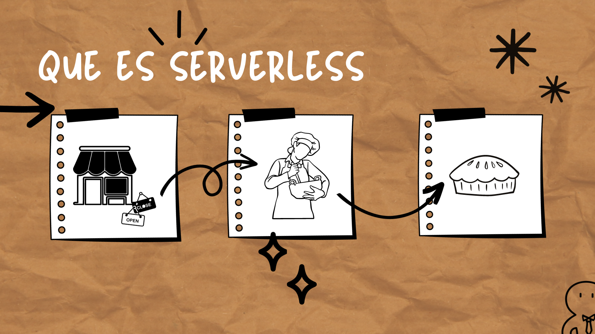
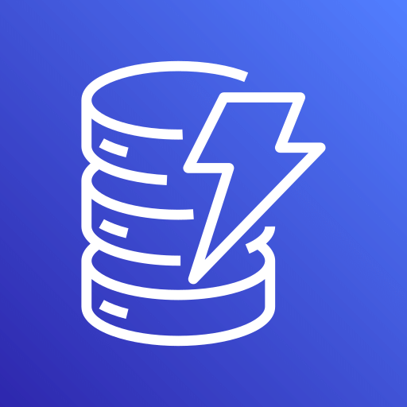
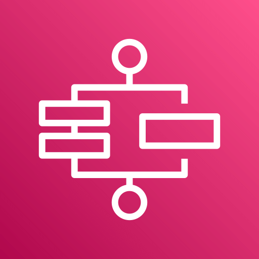

import ReactPlayer from 'react-player'

# 🦄 Introducción al mundo Serverless

## Que es Serverless

El concepto tradicional de "¿Qué es serverless?" nos dice que es un modelo de computación en la nube en el que un proveedor de servicios en la nube gestiona automáticamente la infraestructura de servidores subyacentes. En lugar de preocuparse por aprovisionar, configurar y administrar servidores físicos o virtuales, los desarrolladores pueden centrarse en escribir código y diseñar aplicaciones. ¿Más claro ahora? Bueno, si eres como yo y necesitas un concepto en un lenguaje un poco más humano, aquí tienes otra definición: Imagina que tienes una tienda de pasteles y normalmente necesitas a alguien para hornear pasteles todo el tiempo, incluso cuando no hay clientes. Eso sería como tener un servidor tradicional en la informática, siempre activo y listo para recibir pedidos. Ahora, el concepto de "serverless" (sin servidor) es como contratar a un pastelero solo cuando un cliente entra a tu tienda. No necesitas mantener a alguien trabajando constantemente, solo lo llamas cuando realmente lo necesitas.

En informática, "serverless" significa que no tienes que preocuparte por mantener un servidor en funcionamiento todo el tiempo. Solo activas recursos de computación cuando surge una solicitud o tarea específica que necesita ser atendida, y luego los apagas cuando ya no son necesarios. Es como pagar solo por lo que usas en lugar de mantener un servidor funcionando las 24 horas del día, los 7 días de la semana.

**¿Pero entonces que es serverless?**
En las descripciones anteriores resalta que serverless nace bajo el concepto de utilizar recursos de computo bajo demanda es decir unicamente cuando los necesites y eso suena genial pero va mas allá, cuando el concepto emergio estaba enfocado a servidores, a computo pero con el tiempo esto ha ido evoluciondo, actualmente bajo este mismo concepto puedes encontrar servicios de bases de datos, alamacenamiento, manejo de contenedores y muchos mas que nos permite centrarnos en lo que necesitamos construir y no en los recursos que necesitamos para que funcione.

## Ventajas de una arquitectura serverless

**Administración de Servidores**
    En una arquitectura serverless no necesitas administrar los servidores de tus aplicaciones, eso significa que no necesitas estar al tanto de actualizaciones del sistema operativo, intalación o actualización de software, todo eso es responsabilidad de nuestro proveedor cloud.

**Escalabilidad**
    Cuando trabajamos con aplicaciones la escalabilidad es super importante, nadie quiere que en los momentos de mayor actividad de tu aplicación ésta colapse por no poder manejar bien la carga. Y con una arquitectura serverless tenemos una escalabilidad de forma automatica y equilibrada. 

**Pago por Uso**
    Una de los mayores beneficios de las arquitecturas serverless es que su pago por eso, para dejar de pagar por recursos que no estoy utilizando con serverless solo pago lo que utilizo y cuando no tengo operaciones no tengo un costo que cubrir inecesariamente.

**Alta disponiblidad y tolerancia a fallas**
    Sin necesidad de tener que hacer ningun proceso de DR (Disaster Recovery) de forma automatica los servicios serveless ofrecen alta disponibilidad y tolerancia a fallos de forma predeterminada.

## Cuales servicios de AWS son serverless

 [ AWS Lambda](https://docs.aws.amazon.com/lambda/): es como tener un equipo de trabajadores que solo se activan cuando hay tareas específicas para realizar. Puedes ejecutar código en respuesta a eventos sin preocuparte por administrar servidores. Es ideal para ejecutar funciones pequeñas y efímeras en la nube.

 [ Amazon API Gateway](https://docs.aws.amazon.com/apigateway/): Imagina que tienes una puerta de entrada a tu tienda que gestiona todas las solicitudes de los clientes. Amazon API Gateway es como esa puerta de entrada para tus servicios en la nube. Te ayuda a crear y gestionar APIs que permiten a las aplicaciones acceder a tus funciones y datos en AWS.

 [ Amazon DynamoDB](https://docs.aws.amazon.com/dynamodb/): Piensa en DynamoDB como una base de datos que escala automáticamente según la cantidad de datos que tienes. No necesitas preocuparte por administrar servidores de bases de datos. Es rápido y perfecto para aplicaciones que necesitan almacenar y recuperar datos de manera rápida y eficiente.

 [ Amazon S3 (Simple Storage Service)](https://docs.aws.amazon.com/s3/): Amazon S3 es como tu almacén de objetos en la nube. Puedes guardar y recuperar archivos, imágenes o cualquier tipo de datos de manera segura y confiable. Es excelente para el almacenamiento y la entrega de contenido en aplicaciones web y móviles.

 [ AWS Step Functions](https://docs.aws.amazon.com/step-functions/): ¿Alguna vez has tenido que coordinar una serie de pasos en una tarea compleja? Amazon Step Functions es como tener un asistente que se encarga de coordinar esos pasos de manera automatizada. Puedes crear flujos de trabajo que conectan servicios serverless y otros recursos de AWS.

## Ejemplo de una arquitectura serverless

Una de las arquitecturas serverless más comunes es la implementación de un API serverless. En nuestro ejemplo anterior, imagina que nuestro pastelero está a nuestra disposición únicamente cuando lo necesitamos y nos entrega únicamente los pasteles que le pedimos. Eso es precisamente lo que una API realiza: únicamente nos entrega lo que le pedimos cuando se lo pedimos. Con eso en mente, analicemos la siguiente solución:

En esta solución se utilizan 3 servicios serverless, Amazon API Gateway el cual recibira nuestro pedido, AWS Lambda el cual procesa nuestro pedido y Amazon DynamoDB nuestra base de datos en donde se almacena la información de nuestro pedido.

### Construyámoslo juntos:

En este video aprenderas lo siguiente:
1. Que es una API
1. Tipos de API's
1. Que es Serverless
1. Como crear tu primera API utilizando API Gateway
1. Como crear tu primera Lambda
1. Como probar tu API

<ReactPlayer controls url='https://www.youtube.com/watch?v=devsr3JviUw&ab_channel=WomenWhoCode' width="auto" />  

:gem: Revisa el codigo acá :arrow_right: Repo https://github.com/hsaenzG/DoListsAPI 

:star::star::star: Si te gustó el contenido que ves en el repositorio te invito a que le des star y lo compartas!!