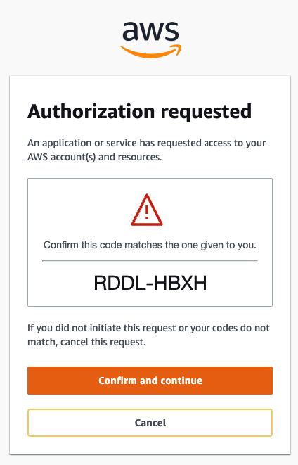
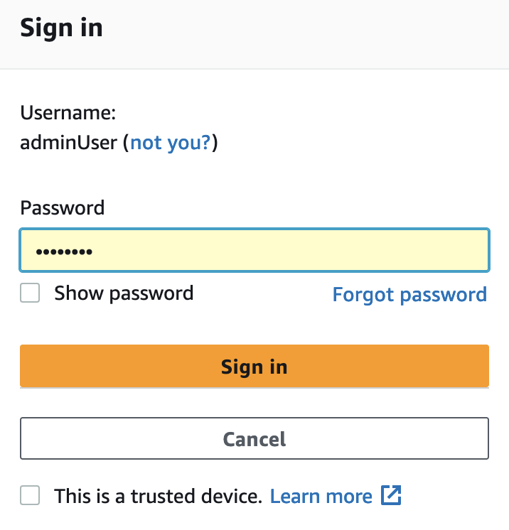
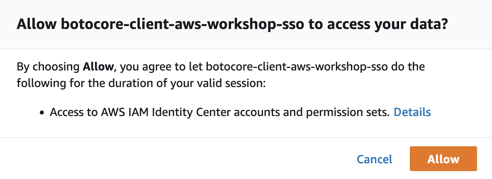
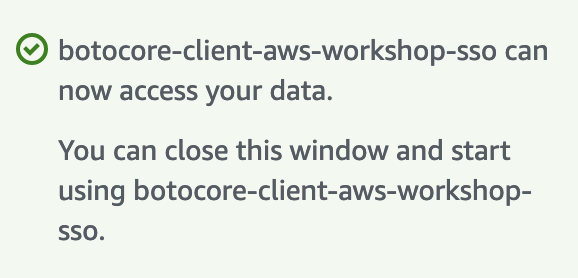

import ReactPlayer from 'react-player'

# Introducción a AWS IAM Identity Center

En esta clase sobre IAM Identity Center, aprenderás:

- Configurar IAM Identity Center
- Crear usuarios y grupos
- Creación de Permission Set usando AWS Managed Policies
- Creación de Permission Set usando Customer Managed Policies
- Creación de Permission Set usando Inline Policies
- Configurar el SSO para tus usuarios
- Configurar el acceso SSO a las cuentas AWS

## AWS IAM Identity Center

<div className="video__wrapper">
    <ReactPlayer className="video__player" controls height="100%" url="https://www.youtube.com/live/FMzr44KHRqg?feature=shared&t=728" width="100%" />
</div>

### Comandos utilizados en clase

- Como configurar SSO desde el AWS CLI

```bash
$ aws configure sso
SSO session name (Recommended): my-new-sso
SSO start URL [None]: https://tu-propio-portal-sso.awsapps.com/start/#
SSO region [None]: us-east-1
SSO registration scopes [sso:account:access]: sso:account:access

### Cuando ingreses los 4 valores de arriba, aparecerá en tu terminal las siguientes líneas.

Attempting to automatically open the SSO authorization page in your default browser.
If the browser does not open or you wish to use a different device to authorize this request, open the following URL:

https://device.sso.us-east-1.amazonaws.com/

Then enter the code:

RDDL-HBXH

```
Se abrirá una pestaña en tu navegador, similar a esta:



Luego, te redirigirá al portal SSO de AWS para que inicies sesion, tal y como se muestra en el vídeo.



Navegue hasta la ventana y haga clic en Permitir.



Aparecerá una pantalla de confirmación en el navegador.



- Para iniciar una sesión SSO (ya configurada) desde tu AWS CLI.
```bash
$ aws sso login --sso-session my-sso
```

- Para cerrar la sesión SSO desde tu AWS CLI.
```bash
$ aws sso logout
```

- Ejemplo de Control de Accesso basado en Tiempo (Política 4D).

```json
{
    "Version": "2012-10-17",
    "Statement": [
        {
            "Effect": "Allow",
            "Action": [
                    "acm:Describe*",
                    "acm:List*",
                    "cloudtrail:Describe*",
                    "cloudtrail:Get*",
                    "cloudtrail:GetTrailStatus",
                    "cloudtrail:ListTags",
                    "cloudtrail:LookupEvents",
                    "cloudwatch:Describe*",
                    "cloudwatch:ListTagsForResource",
                    "config:BatchGetAggregateResourceConfig",
                    "config:BatchGetResourceConfig",
                    "config:Deliver*",
                    "config:Describe*",
                    "config:Get*",
                    "config:List*",
                    "detective:GetGraphIngestState",
                    "detective:ListGraphs",
                    "detective:ListMembers",
                    "ec2:Describe*",
                    "ec2:Get*",
                    "guardduty:DescribePublishingDestination",
                    "guardduty:Get*",
                    "guardduty:List*",
                    "iam:GenerateCredentialReport",
                    "iam:GenerateServiceLastAccessedDetails",
                    "iam:Get*",
                    "iam:List*",
                    "inspector:Describe*",
                    "kms:Describe*",
                    "kms:Get*",
                    "kms:List*",
                    "s3:Get*",
                    "s3:List*",
                    "secretsmanager:DescribeSecret",
                    "secretsmanager:GetResourcePolicy",
                    "secretsmanager:List*",
                    "securityhub:Describe*",
                    "securityhub:Get*",
                    "securityhub:List*",
                    "trustedadvisor:Describe*"
            ],
            "Resource": "*",
            "Condition": {
                "DateGreaterThan": {
                    "aws:CurrentTime": "2024-06-26T00:00:00Z"
                },
                "DateLessThan": {
                    "aws:CurrentTime": "2024-06-27T23:59:59Z"
                }
            }
        }
    ]
}

```

Te invitamos a revisar este <launchButton label="AWS Workshop" url="https://catalog.us-east-1.prod.workshops.aws/workshops/590f8439-42c7-46a1-8e70-28ee41498b3a/en-US" /> para lograr una sólida gestión de identidades con IAM Identity Center.