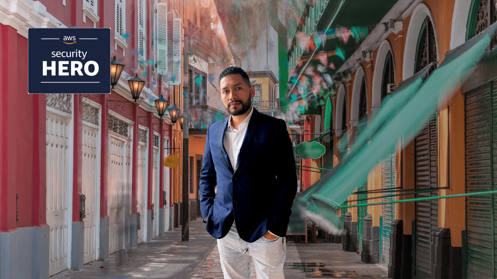

# 💪 ¿Cuál es la motivación?
**[Gerardo Castro](https://www.linkedin.com/in/gerardokaztro/)** en adelante *"Gera"*, es quién diseñó **Cloud Security Ninja**. Durante su viaje hacia el mundo de tecnología, paso por muchos desafíos y la mayoría de ellos, siempre estuvo relacionado con el dinero 💸 que requería para costear su aprendizaje, lo que resultaba en que las oportunidades para conseguir un buen empleo y crecer profesionalmente se vieran muy limitadas.

Por suerte algunas virtudes como la perseverancia, las ganas de aprender, de lucharla y no rendirse, era algo que tenía de sobra 😅. Con el tiempo, encontró en el camino a las personas correctas, aquellas manos amigas que le dieron la oportunidad de aprender y crecer: [Gustavo Cellerico](https://www.linkedin.com/in/adolfo-cellerico/), ¡contigo empezó todo!.

Bajo esta breve anécdota es que se nace **Cloud Security Ninja**, con el único propósito de compartir el conocimiento y la experiencia; que dicho sea de paso costó mucho conseguir de este lado.

## Sobre el autor
En la actualidad, Gera es consultor de Seguridad en Nube. Le gusta escribir blogs técnicos y enseñar sobre ciberseguridad en eventos presenciales y virtuales para diferentes comunidades tech en Latinoamérica. Además, crea y dirige videos, podcasts, clases en línea y talleres enfocados en AWS. Con sus consejos, [ha inspirado a muchas personas a iniciar y hacer crecer su carrera en la nube](https://www.youtube.com/watch?v=woLZeatJGHg).

El cree que un gran poder conlleva una gran responsabilidad y, por lo tanto, su misión durante los últimos años ha sido el de compartir su conocimiento y experiencia en seguridad con los **[usuarios de las comunidades de AWS en la región](https://aws.amazon.com/es/developer/community/usergroups/?nc1=h_ls&community-user-groups-cards.sort-by=item.additionalFields.ugName&community-user-groups-cards.sort-order=asc&awsf.location=location%23latam&awsf.category=*all)**. Algunos de los ejemplos más destacados es el **[Cybersecurity Bootcamp](https://github.com/gerardokaztro/cybersecurity-entry-level)** y los **AWS Security Days - Community Edition,** que son eventos impulsados por la comunidad organizados en algunos países como Argentina, Perú y Chile, y más por venir para otros países de habla hispana.

Gera fue **AWS Community Builder for Security & Identity** desde 2020 al 2023, y es organizador del **[AWS Security Users Group](https://www.meetup.com/es/awssecuritylatam/)** en América Latina desde 2020.

En el 2023 obtuvo 2 nominaciones por parte de **AWS** como **AWS Security Black Belt** y la mas reciente y destacada **[AWS Security Hero](https://aws.amazon.com/es/developer/community/heroes/gerardo-castro/)** considerada un hito al ser nominado dentro del primer cohort a nivel mundial y ser el primero en Hispanoamérica.

Conoce a los demás **[AWS Heroes de Hispanoamérica](https://aws.amazon.com/developer/community/heroes/?nc1=h_ls&community-heroes-all.sort-by=item.additionalFields.sortPosition&community-heroes-all.sort-order=asc&awsf.filter-hero-category=*all&awsf.filter-location=location%23latam&awsf.filter-year=*all&awsf.filter-activity=*all).**
