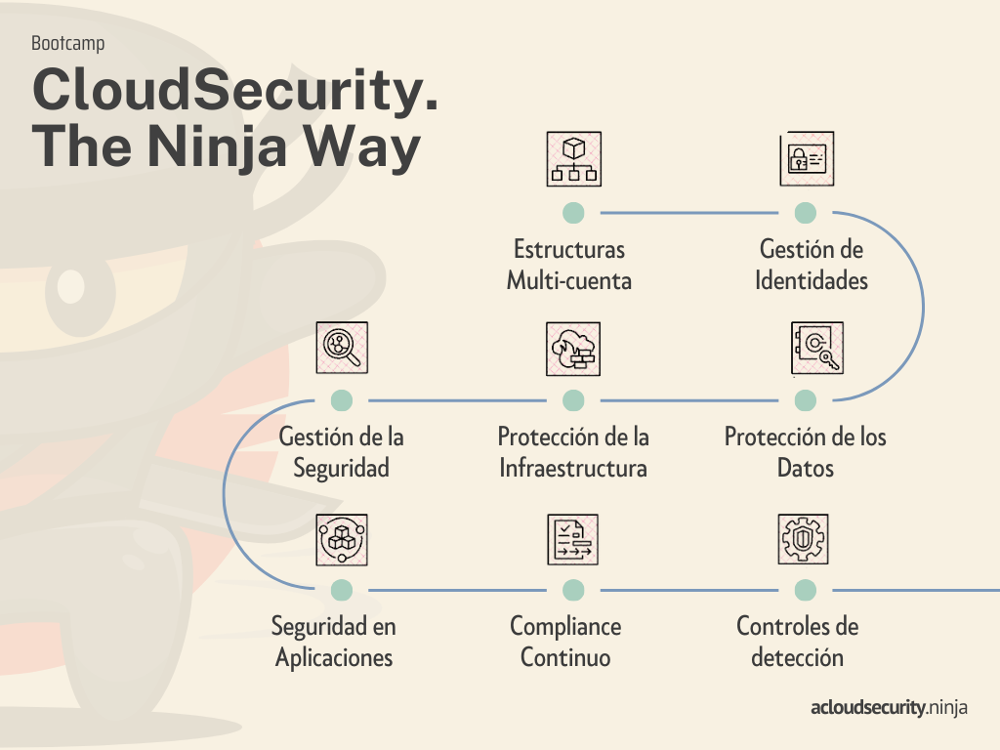

# 🚀 Ruta de aprendizaje

Inicia tu viaje hacia la Seguridad en la Nube con esta ruta de aprendizaje que toma como referencia e inspiración algunas fuentes como el **[Ramp-Up Guide de AWS Security](https://d1.awsstatic.com/training-and-certification/ramp-up_guides/Ramp-Up_Guide_Security.pdf)**, **[Pilar de Seguridad de AWS](https://docs.aws.amazon.com/es_es/wellarchitected/latest/security-pillar/welcome.html)**, **[NIST CSF](https://www.nist.gov/cyberframework)**, entre otras.

## Desde outsiders a principiantes

En nuestro intento de no dejar a nadie fuera, hemos creado esta mini ruta, cortita y al pie, para todas aquellas personas ajenas al área de la tecnología. Estos temas te ayudarán a aprender los fundamentos de las principales tecnologías que como futuro profesional de TI debes saber.

<table border="1" width="100%"> 
    <tbody>
        <tr>
            <td width="auto"><b>Módulo</b></td>
            <td><b>Fundamentos de TI</b></td>
            <td><b>Computación en la nube</b></td>
            <td><b>Ciberseguridad</b></td>
            <td><b>Seguridad DE la Nube</b></td>
        </tr>
        <tr>
            <td><b>Temas</b></td>
            <td>
                <a href="/docs/fundamentos-de-tecnologia/redes" >-Redes</a>
                 
                <a href="/docs/fundamentos-de-tecnologia/serverless" >-Serverless</a>
                 
                <a href="/docs/fundamentos-de-tecnologia/devops" >-DevOps</a>
                 
                <a href="/docs/fundamentos-de-tecnologia/iac" >-Infraestructura como Código</a>
                 
                <a href="/docs/fundamentos-de-tecnologia/terraform" >-Introducción a Terraform</a>
            </td>
            <td>
                <a href="/docs/fundamentos-de-nube/introduccion" >-Introducción al Cloud Computing</a>
                 
                <a href="/docs/fundamentos-de-nube/aws" >-Fundamentos de AWS</a>
            </td>
            <td> 
                <a href="/docs/fundamentos-de-ciberseguridad/introduccion" >-Introducción a la Ciberseguridad</a>
                 
                <a href="/docs/fundamentos-de-ciberseguridad/ethical-hacking" >-Ethical Hacking</a>
                 
                <a href="/docs/fundamentos-de-ciberseguridad/metodologias/metodologias-y-frameworks/" >-Metodologías y Frameworks</a>
            </td>
            <td> 
                <a href="/docs/fundamentos-de-seguridad-aws/responsabilidad-compartida" >-Modelo de responsabilidad compartida</a>
                 
                <a href="/docs/fundamentos-de-seguridad-aws/programas-de-cumplimiento" >-Programas de cumplimiento</a>
                 
                <a href="/docs/fundamentos-de-seguridad-aws/well-architected-sec" >-Pilar de Seguridad del Well Architected Framework</a>
            </td>
        </tr>
    </tbody>
</table>

## Desde principiantes a avanzados

El contenido se encuentra aún en desarrollo e irá siendo publicado según el cronograma de [CloudSecurity. The Ninja Way](https://forms.gle/VterzvZoUeupjAZw5). Un nuevo bootcamp gratutito donde aprenderás cómo gestionar e implementar seguridad a tus cargas de trabajo en la nube usando los principales servicios de seguridad de Amazon Web Services.

Pedimos que tengan mucha empatía y paciencia con la publicación de cada tema, esto es totalmente gratis para todos ustedes, sin embargo tengan en cuenta que detrás de escena, existe muchas variables de inversión como horas de coordinación, de redacción, tazas de café y cuestiones varias. Hacemos esto solo por pasión, voluntad y la convicción de hacer una comunidad tecnológica mas representada.

<table border="1" width="100%">
    <tbody>
        <tr>
            <td width="auto"><b>Categoría</b></td>
            <td colspan="7"><b>Servicios de seguridad Amazon Web Services</b></td>
        </tr>
        <tr bgcolor="#BED3E1">
            <td><b>Cloud Foundations: Estructuras Multi-Cuenta</b></td>
            <td colspan="3">
                <a href="/docs/estructuras-multi-cuenta/aws-organizations" >AWS Organizations</a>
            </td>
            <td colspan="4">
                <a href="/docs/estructuras-multi-cuenta/aws-control-tower" >AWS Control Tower</a>
            </td>
        </tr>
        <tr bgcolor="#BED3E1">
            <td><b>Gestión de identidades y accesos</b></td>
            <td>
                <a href="/docs/gestion-de-identidad-y-accesos/aws-iam" >AWS IAM</a>
            </td>
            <td>
                <a href="" >AWS Identity Center</a>
            </td>
            <td>
                <a href="" >IAM Access Analyzer</a>
            </td>
            <td>
                <a href="" >AWS Secrets Manager</a>
            </td>
            <td>
                <a href="" >Amazon Cognito</a>
            </td>
            <td>
                <a href="" >Amazon Verified Permissions</a>
            </td>
            <td>
                <a href="" >EC2 instance Metadata Service</a>
            </td>
        </tr>
        <tr bgcolor="#BED3E1">
            <td><b>Protección de los datos</b></td>
            <td>
                <a href="" >Seguridad y Privacidad de los datos en la nube de AWS</a>
            </td>
            <td>
                <a href="" >Cifrado en Reposo</a>
            </td>
            <td>
                <a href="" >Cifrado en Tránsito</a>
            </td>
            <td>
                <a href="" >Seguridad y Privacidad en Amazon S3</a>
            </td>
            <td>
                <a href="" >Gestión de accesos en Amazon S3</a>
            </td>
            <td>
                <a href="" >Descubrimiento y clasificación de datos con Amazon Macie</a>
            </td>
            <td>
                <a href="" >AWS Wickr</a>
            </td>
        </tr>
        <tr bgcolor="#BED3E1">
            <td><b>Protección de la infraestructura</b></td>
            <td>
                <a href="" >NACLs Security Groups</a>
            </td>
            <td>
                <a href="" >AWS WAF</a>
            </td>
            <td>
                <a href="" >AWS Shield</a>
            </td>
            <td>
                <a href="" >AWS Network Firewall</a>
            </td>
            <td>
                <a href="" >Amazon Route 53 Resolver DNS Firewall</a>
            </td>
            <td>
                <a href="" >AWS Firewall Manager</a>
            </td>
            <td>
                <a href="" >AWS Verified Access</a>
            </td>
        </tr>
        <tr bgcolor="#BED3E1">
            <td><b>Gestión de la seguridad</b></td>
            <td>
                <a href="" >Amazon Inspector</a>
            </td>
            <td colspan="2">
                <a href="" >AWS Systems Manager</a>
            </td>
            <td colspan="2">
                <a href="" >EC2 Instance Connect Endpoint</a>
            </td>
            <td colspan="2">
                <a href="" >AWS Resource Access Manager</a>
            </td>
        </tr>
        <tr bgcolor="#BED3E1">
            <td><b>Seguridad en aplicaciones</b></td>
            <td>
                <a href="" >Revisión de seguridad en aplicaciones a escala</a>
            </td>
            <td colspan="2">
                <a href="" >Application Security Testing en AWS</a>
            </td>
            <td colspan="2">
                <a href="" >DevSecOps</a>
            </td>
            <td colspan="2">
                <a href="" >API Security</a>
            </td>
        </tr>
        <tr bgcolor="#BED3E1">
            <td><b>Compliance Continuo</b></td>
            <td>
                <a href="" >AWS CloudTrail</a>
            </td>
            <td>
                <a href="" >AWS CloudWatch Logs</a>
            </td>
            <td>
                <a href="" >AWS Config</a>
            </td>
            <td colspan="2">
                <a href="" >AWS Security Hub</a>
            </td>
            <td colspan="2">
                <a href="" >AWS Audit Manager</a>
            </td>
        </tr>
        <tr bgcolor="#BED3E1">
            <td><b>Controles de detección</b></td>
            <td colspan="2">
                <a href="" >Amazon GuardDuty</a>
            </td>
            <td colspan="2">
                <a href="" >AWS Security Lake</a>
            </td>
            <td colspan="3">
                <a href="" >Opciones de SIEM en AWS</a>
            </td>
        </tr>
        <tr bgcolor="#BED3E1">
            <td><b>Respuesta ante incidentes</b></td>
            <td colspan="2">
                <a href="" >AWS Customer Incident Response Team</a>
            </td>
            <td colspan="2">
                <a href="" >Cómo evitar y responder ante los siguientes tipos de incidentes</a>
            </td>
            <td colspan="3">
                <a href="" >Cyber Threat Hunting - Amazon Detective</a>
            </td>
        </tr>
        <tr bgcolor="#BED3E1">
            <td><b>Seguridad en contenedores</b></td>
            <td>
                <a href="" >Problemática de seguridad en contenedores</a>
            </td>
            <td colspan="2">
                <a href="" >Modelo de responsabilidad compartida en ECS / EKS</a>
            </td>
            <td colspan="2">
                <a href="" >Defensa en profundidad en contenedores</a>
            </td>
            <td colspan="2">
                <a href="" >Buenas prácticas de seguridad en contenedores</a>
            </td>
        </tr>
        <tr bgcolor="#BED3E1">
            <td><b>Delegación de permisos</b></td>
            <td colspan="2">
                <a href="" >IAM Permission Boundaries</a>
            </td>
            <td colspan="2">
                <a href="" >Data Perimeter</a>
            </td>
            <td colspan="3">
                <a href="" >IAM generation pipeline</a>
            </td>
        </tr>
        <tr bgcolor="#BED3E1">
            <td><b>Cómo priorizar las recomendaciones</b></td>
            <td colspan="7">
                <a href="https://maturitymodel.security.aws.dev/es/" >AWS Security Maturity Model</a>
            </td>
        </tr>
    </tbody>
</table>
